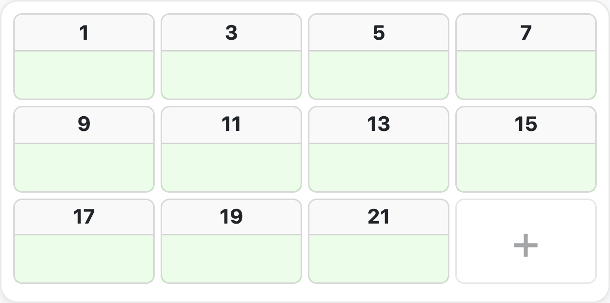
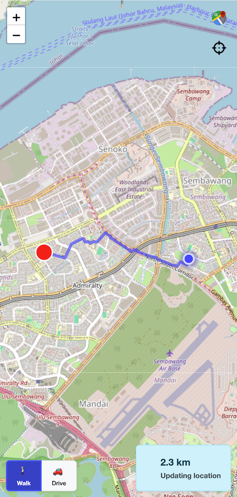

# 機能概要

## はじめに

Ministry Mapperは、宗教団体向けに設計された包括的なデジタル区域管理プラットフォームです。このページでは、すべての機能と能力について詳細に説明します。

---

## 🗺️ 区域管理

### 地理的領域の整理

**区域の作成と管理：**
- 会衆ごとに無制限の区域を作成
- 固有のコードと説明を割り当て
- ドラッグ＆ドロップで優先順位に従って区域を整理
- 完了率を自動的に追跡
- 区域のステータスをリセットして追跡を再開
- 区域間で地図を簡単に移動

**区域統計：**
- 集計された完了追跡
- 視覚的な進捗インジケーター
- 統計のリアルタイム更新
- 区域ごとの詳細分析
- 履歴追跡

**使用例：** 会衆の奉仕区域を管理しやすい区域に分割し、組織的な野外奉仕活動を行います。

---

## 🏢 地図と住所の管理

### インタラクティブな位置追跡

**地図の種類：**

**1. 公共住所（複数階建ての建物）**
- 複数階建ての建物をサポート
- 階の動的な追加・削除
- 各階に複数のユニットを含む
- すべての階に住所コードを自動適用
- 階ごとの整理

**2. 個人住所（一戸建て住宅）**
- 個別の住宅または独立した物件
- 階の細分化のないシンプルな構造
- 迅速な住所入力

**地図機能：**
- 正確な位置特定のためのGPS座標の添付
- 詳細な説明の追加
- 組織的な訪問のための連番
- Leaflet/OpenStreetMapによる視覚的な地図統合
- 任意の住所への道順案内
- ジオロケーションサポート

**住所操作：**
- 住所コードの追加・削除
- 最適なルーティングのための住所の並べ替え
- 効率的な一括操作
- 階間での住所のコピー
- 名前の変更と再整理

**その場での住所追加** *(v1.33+)*
- 伝道者はマッピング中に不足している住所を直接追加できます — 管理者の操作は不要
- 住所リストの末尾に **「+」** カードがクイック追加の入口として表示されます
- テリトリー記録をまだ整備中の会衆に最適です



---

## 📊 ユニット/世帯の追跡

### 包括的な訪問ステータス管理

**ステータスの種類：**

| ステータス | 説明 | 進捗への影響 |
|--------|-------------|-------------------|
| **未完了** | 初期状態、まだ訪問していない | 未完了としてカウント |
| **完了** | 正常に完了 | 完了としてカウント |
| **不在** | 不在、再試行可能 | 最大試行回数後にカウント |
| **訪問不可（DNC）** | 世帯が訪問を拒否 | カウントから除外 |
| **無効** | ユニットが存在しない | カウントから除外 |

**不在追跡：**
- 会衆ごとに設定可能な最大試行回数
- 自動カウンター増加
- 最大試行回数後は「完了」として扱う
- 無期限の再訪問を防止

**完了ロジック：**
```
完了条件：
  - ステータス = 完了、または
  - ステータス = 不在 かつ 試行回数 >= 最大試行回数

進捗率 % = 完了 / カウント可能なユニット総数 × 100
```

**世帯オプション：**
- カスタマイズ可能な住所分類
- カウント可能/不可能なタイプ
- 新しい住所のデフォルトオプション
- 住所ごとに複数のオプション
- 進捗計算に影響

**訪問メモ：**
- 住所ごとに詳細なメモを追加
- 自動タイムスタンプ追跡
- 更新者の追跡
- メモ変更のメール通知
- 履歴メモの閲覧

---

## 🔗 割り当てシステム（伝道者リンク）

### 安全で時間制限付きのアクセス

**リンク機能：**
- **時間制限：** 設定可能な有効期限（デフォルト24時間）
- **トークンベース：** 安全な20文字のアクセストークン
- **アカウント不要：** 伝道者はリンクのみでアクセス
- **2つのタイプ：**
  - 通常の区域作業用の通常割り当て
  - 個人伝道用の個人割り当て

**インテリジェントな割り当てアルゴリズム：**

新しい割り当てをリクエストすると、システムは：

1. **主要因：** アクティブな割り当てが最も少ない地図を選択
   - 単一の地図への過負荷を防止
   - ワークロードのバランスを取る

2. **副次的要因：** 地理的に近い地図を優先
   - GPS座標を使用
   - 50メートルの閾値
   - 移動時間を短縮

3. **第三の要因：** 完了進捗が低い地図を優先
   - バランスの取れた区域完了を確保
   - 一部の地域が無視されるのを防止

**割り当てワークフロー：**
```
1. 司会者が割り当てリンクを生成
2. リンクを伝道者と共有（QR、メール、テキスト）
3. 伝道者が /map/:assignmentId にアクセス
4. システムがトークンと有効期限を検証
5. 伝道者がリアルタイムで住所ステータスを更新
6. リンクは自動的に期限切れ
7. 管理者がリアルタイム更新を受信
```

**割り当て管理：**
- 地図ごとのアクティブな割り当てを表示
- 誰がどの区域を持っているかを確認
- 割り当て履歴を追跡
- 手動での割り当て削除
- 期限切れリンクの自動クリーンアップ（5分ごと）

---

## 👥 ユーザー管理とアクセス制御

### ロールベースの権限システム

**4つのユーザーロール：**

#### 1. 伝道者（最も制限的）
**アクセス方法：** 時間制限付きの割り当てリンクのみ

**権限：**
- ✅ 割り当てられた地図のみを表示
- ✅ 住所/ユニットのステータスを更新
- ✅ 訪問メモを追加
- ✅ フィードバックメッセージを送信
- ❌ 他の区域を見ることはできない
- ❌ 区域を作成することはできない
- ❌ ユーザーを管理することはできない

**使用例：** 区域で作業する野外奉仕の伝道者

---

#### 2. 読み取り専用
**アクセス方法：** 読み取り専用ロールのユーザーアカウント

**権限：**
- ✅ すべての会衆データを表示
- ✅ 区域と地図を表示
- ✅ 住所情報を表示
- ✅ メッセージを表示
- ❌ 何も変更できない
- ❌ 割り当てを作成できない
- ❌ ユーザーを管理できない

**使用例：** オブザーバー、監査役、奉仕委員会メンバー

---

#### 3. 司会者（中間レベル）
**アクセス方法：** 司会者ロールのユーザーアカウント

**権限：**
- ✅ 読み取り専用のすべての権限
- ✅ 区域の作成と管理
- ✅ 地図の作成と管理
- ✅ 住所の追加・更新
- ✅ 伝道者の割り当てリンクを生成
- ✅ すべての会衆データを表示
- ✅ 世帯オプションを管理
- ✅ 区域をリセット
- ❌ ユーザーロールを管理できない
- ❌ 会衆設定を構成できない
- ❌ ユーザーを削除できない

**使用例：** 野外奉仕監督、区域コーディネーター

---

#### 4. 管理者（フルアクセス）
**アクセス方法：** 管理者ロールのユーザーアカウント

**権限：**
- ✅ 司会者のすべての権限
- ✅ ユーザーの作成と管理
- ✅ ユーザーロールの割り当て
- ✅ 会衆設定の構成
- ✅ 世帯オプションの管理
- ✅ 区域と地図の削除
- ✅ ユーザーアカウントの削除
- ✅ すべての割り当てとメッセージを表示
- ✅ 最大不在試行回数の設定
- ✅ リンク有効期限の設定
- ✅ システムログへのアクセス

**使用例：** 区域担当者、システム管理者

---

### ユーザーアカウント管理

**機能：**
- メールベースの認証
- メール確認が必要
- パスワードリセット機能
- OAuth2 Google認証
- 多要素認証（MFA）サポート
- ワンタイムパスワード（OTP）サポート
- アカウントの無効化/有効化
- 最終ログイン追跡
- 複数会衆サポート（会衆ごとに異なるロール）

---

## 🛠️ 会衆設定

### カスタマイズ可能な構成

**コア設定：**

**1. 最大不在試行回数**
- 「完了」と見なす前の「不在」訪問回数を設定
- 一般的：2〜3回
- 進捗計算に影響
- 会衆固有

**2. 割り当てリンクの有効期限**
- リンクの有効期間を設定
- デフォルト：24時間
- 会衆ごとにカスタマイズ可能
- 期限切れリンクの自動クリーンアップ

**3. 世帯オプション**
- カスタム住所分類を作成
- 例：「住宅」、「ビジネス」、「高層ビル」、「言語：スペイン語」
- オプションを「カウント可能」としてマーク（完了率に影響）
- 新しい住所のデフォルトオプションを設定
- ドラッグ＆ドロップで並べ替え
- 各オプションを持つ住所を表示

**4. 地域設定**
- タイムゾーン設定
- 国/地域の選択
- 日付計算とレポートに影響

---

## 💬 コミュニケーションとメッセージング

### アプリ内コミュニケーションシステム

**メッセージの種類：**

**1. 伝道者メッセージ**
- 伝道者から司会者/管理者へ
- 特定の地図に添付
- 区域固有のフィードバック
- リアルタイム配信

**2. 司会者メッセージ**
- 管理的なコミュニケーション
- 地図固有の指示
- 調整メッセージ

**3. 管理者メッセージ**
- 可視性のために固定可能
- 既読ステータス追跡
- 重要なお知らせ
- 伝道者へのブロードキャスト

**4. 固定メッセージ**
- 固定解除されるまで表示されたまま
- ユーザーごとの既読追跡
- 関連ユーザーへの自動メール
- 優先表示

**メール通知：**

以下の自動メールダイジェストが送信されます：
- **30分ごと：** 管理者への未読メッセージ
- **30分ごと：** 伝道者への固定管理者メッセージ
- **1時間ごと：** 管理者へのメモ更新
- **毎月：** Excel添付付きの会衆レポート

**メールテンプレート：**
- プロフェッショナルなHTMLテンプレート
- モバイルレスポンシブデザイン
- 関連リンクを含む
- カスタマイズ可能なコンテンツ

---

## 🔄 リアルタイムコラボレーション

### ライブデータ同期

**リアルタイム機能：**

**SSEサブスクリプション：**
- Server-Sent Events（SSE）によるライブ更新
- 切断時の自動再接続
- 低レイテンシ（通常100ms未満）

**同時編集：**
- 複数のユーザーが同時に作業可能
- 競合やデータ損失なし
- 最終書き込み優先戦略
- タイムスタンプベースの解決

**自動更新：**
- 変更時にデータが即座に更新
- 手動でのページ更新は不要
- 更新の視覚的インジケーター
- 楽観的なUI更新

**可視性検出：**
- タブが表示されると自動的に更新
- タブが非表示の場合は帯域幅を節約
- 古いデータを防止

**コラボレーションシナリオ：**
- 管理者が区域を作成中に司会者がリストを表示 → 即座に表示
- 伝道者がユニットを完了としてマーク → 管理者が進捗更新をライブで確認
- 複数の司会者が異なる区域を管理 → 競合なし
- 作業が進むにつれてリアルタイムで統計が更新

---

## 📱 プログレッシブウェブアプリ（PWA）

### ネイティブアプリ体験

**PWA機能：**

**インストール可能：**
- ホーム画面に追加（モバイル）
- デスクトップアプリとしてインストール
- アプリランチャーに表示
- フルスクリーンモード
- カスタムアプリアイコン

**デスクトップインストール：**
```
URLにアクセス → ブラウザメニュー → 「アプリをインストール」
```

**モバイルインストール：**
```
URLにアクセス → 共有 → 「ホーム画面に追加」
```

**オフラインサポート：**
- サービスワーカーによる静的アセットのキャッシュ
- オフライン時もキャッシュされたデータを表示し続ける
- 接続回復時の自動同期
- バックグラウンド更新

**パフォーマンスの利点：**
- 高速な読み込み時間（キャッシュされたアセット）
- データ使用量の削減
- 遅い接続でも動作
- スムーズなアニメーション

**ネイティブ機能：**
- プッシュ通知（計画中）
- バックグラウンド同期
- ネイティブファイル処理
- Share API統合

---

## 🌍 国際化

### 多言語サポート

**対応言語：**
1. **英語** (en) - 主要言語
2. **スペイン語** (es) - Español
3. **インドネシア語** (id) - Bahasa Indonesia
4. **日本語** (ja) - 日本語
5. **韓国語** (ko) - 한국어
6. **マレー語** (ms) - Bahasa Melayu
7. **中国語** (zh) - 中文
8. **タミル語** (ta) - தமிழ்

**i18n機能：**
- ナビゲーションの言語セレクター
- 永続的な設定（localStorage）
- ブラウザ言語検出
- 完全なUI翻訳
- 動的な切り替え（リロード不要）
- 新しい言語の追加が容易

**ローカライズされたリリースノート：**
- アプリ内チェンジログがユーザーの選択した言語で表示されます
- 全8言語をサポート
- 新しいバージョンが検出されると自動的にモーダルが表示されるため、伝道者はアプリを離れることなく新機能を確認できます

**新しい言語の追加：**
1. `src/i18n/locales/[lang].json`に翻訳ファイルを作成
2. `en.json`から構造をコピー
3. すべての文字列を翻訳
4. `src/i18n/index.ts`に登録

---

## 🌙 ダークモード

### システム対応テーマ

**テーマオプション：**
- **ライトモード：** 従来のライトテーマ
- **ダークモード：** 目に優しいダークテーマ
- **システム：** OS設定に従う

**利点：**
- 目の疲れを軽減
- バッテリー寿命の向上（OLED画面）
- アクセシビリティ準拠
- モダンなユーザー体験

**実装：**
- CSSカスタムプロパティ
- スムーズなトランジション
- 永続的な設定
- 間違ったテーマのフラッシュなし

---

## 📈 レポートと分析

### 包括的な統計

**月次会衆レポート：**
- **スケジュール：** 毎月1日の深夜
- **形式：** Excelワークブック（.xlsx）
- **配信：** すべての管理者にメール

**レポート内容：**

**1. 会衆概要**
- 会衆名と詳細
- 報告期間
- 全体統計

**2. 区域内訳**
- 区域ごとの完了率
- 区域ごとの地図数
- 住所の分布
- 時間経過に伴う進捗

**3. 住所統計**
- タイプ別の総住所数
- ステータス分布（完了、未完了など）
- カウント可能/不可能の内訳
- DNCと無効のカウント

**4. 伝道者の割り当て**
- アクティブな割り当て数
- 割り当て履歴
- 区域カバレッジ

**5. 進捗追跡**
- 月ごとの比較
- トレンドと洞察
- 注意が必要な領域

**Excel機能：**
- プロフェッショナルなフォーマット
- チャートとグラフ
- ピボット対応データ
- 印刷に適したレイアウト

**リアルタイムダッシュボード：**
- 管理パネルでのライブ統計
- 区域完了追跡
- 住所ステータスの分布
- アクティブな割り当ての監視
- 最近のアクティビティフィード

**AIレポート要約：**
- 月次会衆レポートには、区域のメモとメッセージから収集した主要トレンドの AI 生成要約を含めることができます
- **OpenAI gpt-5.4-mini** を使用
- `enable-report-ai-summary` フィーチャーフラグで制御 — デプロイごとのオプトインにより、会衆が有効化を選択
- デプロイ環境に `OPENAI_API_KEY` の設定が必要

---

## 🔐 セキュリティ機能

### エンタープライズグレードのセキュリティ

**認証方法：**

**1. メール/パスワード**
- Bcryptパスワードハッシュ（コスト：10）
- 最小6文字
- メール確認が必要
- メールによるパスワードリセット

**2. OAuth2（Google）**
- セキュリティのためのPKCEフロー
- 自動ユーザー作成
- パスワード管理不要
- 安全なトークン処理

**3. ワンタイムパスワード（OTP）**
- オプションの4桁コード
- 180秒の有効期間
- 追加のセキュリティレイヤー
- メール配信

**4. 多要素認証（MFA）**
- TOTPサポート
- 管理者向けの強化されたセキュリティ
- 1800秒のセッション
- バックアップコード

**アクセス制御：**

**ロールベースのアクセス制御（RBAC）：**
- きめ細かい権限
- 会衆レベルの分離
- マルチテナントアーキテクチャ
- デフォルトで安全

**リンクベースのアクセス：**
- 一時的な匿名アクセス
- トークンベースの認証
- 自動有効期限
- 取り消し可能なアクセス

**セキュリティのベストプラクティス：**
- HTTPS強制
- CORS設定
- レート制限
- SQLインジェクション防止（パラメータ化されたクエリ）
- XSS保護
- CSRF保護
- 入力検証
- 出力サニタイズ

**監査証跡：**
- ユーザーアクションのログ
- 変更追跡
- 誰がいつ何を更新したか
- IPアドレスのログ
- 認証試行

**エラー追跡：**
- Sentry統合
- リアルタイムエラー監視
- デバッグ用のスタックトレース
- リリース追跡
- パフォーマンス監視

**ユーザーライフサイクル管理：**

**NIST AC-2** および **AC-2(3)** セキュリティ管理に準拠した、非アクティブおよび未プロビジョニングユーザーアカウントの自動処理：

- **未プロビジョニングユーザー：** セットアップを完了していないアカウントは、自動無効化・最終的な削除の前に段階的な警告メールを受信します
- **非アクティブユーザー：** 設定された期間ログイン活動のないアカウントは警告を受け、その後無効化されます
- バックグラウンドジョブが毎日ライフサイクルポリシーを評価・適用 — 手動の介入は不要
- 休眠アカウントによる攻撃対象領域を最小化し、会衆のユーザーリストを正確に保ちます

---

## 🗺️ インタラクティブマッピング

### Leaflet + OpenStreetMap統合

**マッピング機能：**

**基本機能：**
- インタラクティブなパンとズーム
- ストリートレベルの詳細
- 衛星画像オプション
- 住所のカスタムマーカー
- 区域境界の可視化
- 密集エリアのクラスターマーカー

**ナビゲーション：**
- 任意の住所への道順案内
- デバイスのマップアプリとの統合
- 距離計算
- 最適ルート計画
- GPS位置サポート

**ルーティングサービス（ターンバイターンの道順案内）：**
- **OpenRouteService** によるビルトインルーティング機能
- **ドライブ**、**ウォーキング**、**サイクリング** の3つの移動モードをサポート
- 伝道者はマップビューから直接任意の住所への道順をリクエストできます
- 住所のジオコーディングは **LocationIQ** で処理されます



**ジオロケーション：**
- 現在地を検出
- ユーザーを中心にマップを配置
- 近接ベースの割り当て
- 区域までの距離

**カスタムマーカー：**
- ステータスベースの色分け
- カスタムアイコン
- 情報ポップアップ
- クリック操作
- マーカークラスタリング

**パフォーマンス：**
- タイルの遅延読み込み
- 効率的なマーカーレンダリング
- ビューポートベースの読み込み
- モバイル最適化

**利点：**
- API制限なし
- 無料で使用
- 請求不要
- OpenStreetMapデータ
- 完全なオフラインタイルキャッシュが可能

---

## 📧 メールシステム

### 自動メール通知

**メールサービス：** MailerSend API v1

**メールの種類：**

**1. メッセージ通知**
- スケジュール：30分ごと
- 受信者：管理者
- 内容：未読の伝道者メッセージ
- テンプレート：プロフェッショナルなHTML

**2. 管理者の指示**
- スケジュール：30分ごと
- 受信者：伝道者（非管理者ユーザー）
- 内容：固定された管理者メッセージ
- テンプレート：指示形式

**3. メモ更新**
- スケジュール：1時間ごと
- 受信者：管理者
- 内容：住所のメモ変更
- テンプレート：メモダイジェスト形式

**4. 月次レポート**
- スケジュール：毎月1日
- 受信者：管理者
- 内容：統計レポートとオプションのAI生成区域サマリー
- 添付ファイル：Excelワークブック
- AIサマリー：`enable-report-ai-summary`機能フラグと`OPENAI_API_KEY`が設定されている場合、各区域シートにはAI生成の主要トレンドと注目すべき観察事項の概要が含まれます

**5. システムメール**
- メール確認
- パスワードリセット
- アカウントアラート
- 認証通知

**テンプレート機能：**
- モバイルレスポンシブHTML
- プロフェッショナルなデザイン
- 互換性のためのインラインCSS
- プレーンテキストのフォールバック
- 配信停止リンク
- トラッキングピクセル（オプション）

---

## 🔄 バックグラウンドジョブ

### 自動タスク処理

**ジョブスケジューラー：** LaunchDarkly機能フラグを使用したCronベース

**スケジュールされたジョブ：**

| ジョブ | スケジュール | 目的 |
|-----|----------|---------|
| 割り当てクリーンアップ | 5分ごと | 期限切れの割り当てを削除 |
| 区域集計 | 10分ごと | 進捗統計を更新 |
| メッセージ処理 | 30分ごと | メッセージ通知を送信 |
| 指示 | 30分ごと | 管理者メッセージを送信 |
| メモ更新 | 1時間ごと | メモ変更を通知 |
| 月次レポート | 毎月1日 | Excelレポートを生成（オプションのAIサマリー付き） |
| 未プロビジョニングユーザー | 毎日01:00 UTC | ユーザーライフサイクルを強制（警告→無効化→削除） |
| 非アクティブユーザー | 毎日01:30 UTC | 非アクティブなアカウントを警告して無効化 |

**機能フラグ制御：**
- デプロイなしでジョブを有効化/無効化
- 段階的なロールアウト機能
- A/Bテスト
- 緊急オフスイッチ
- 会衆ごとの制御

**ジョブ監視：**
- 実行ログ
- 成功/失敗の追跡
- 所要時間メトリクス
- エラーアラート
- リトライロジック

---

## 🎨 ユーザーインターフェース

### モダンでレスポンシブなデザイン

**UIフレームワーク：** Bootstrap 5.3.8 + カスタムコンポーネント

**デザイン原則：**
- モバイルファーストアプローチ
- タッチフレンドリーな操作
- アクセシビリティ準拠（WCAG 2.1）
- 一貫した視覚言語
- 直感的なナビゲーション

**主要なUI要素：**

**ナビゲーション：**
- レスポンシブなナビゲーションバー
- 会衆セレクター
- スピードダイヤル（フローティングアクションボタン）
- パンくずナビゲーション
- クイックリンク

**フォーム：**
- インライン検証
- エラーメッセージ
- 下書きの自動保存
- キーボードショートカット
- プログレッシブディスクロージャー

**テーブル：**
- ソート可能な列
- インライン編集
- 一括操作
- ページネーション
- 検索とフィルター
- エクスポート機能

**モーダル：**
- 24以上の専用モーダル
- キーボードナビゲーション
- フォーカス管理
- スタッキングサポート
- モバイル最適化

**フィードバック：**
- トースト通知
- ローディングインジケーター
- プログレスバー
- 成功確認
- エラーアラート

**レスポンシブブレークポイント：**
- モバイル：<768px
- タブレット：768px-1024px
- デスクトップ：>1024px
- 大画面デスクトップ：>1440px

---

## 🚀 パフォーマンス

### 速度に最適化

**フロントエンドの最適化：**
- ルートごとのコード分割
- コンポーネントの遅延読み込み
- 画像最適化
- CSS縮小
- JavaScriptバンドル
- ツリーシェイキング
- サービスワーカーキャッシュ

**React 19コンパイラ：**
- 自動メモ化
- 手動最適化不要
- より小さいバンドルサイズ
- より高速なレンダリング

**バックエンドの最適化：**
- データベースインデックス（25以上のインデックス）
- クエリ最適化
- コネクションプーリング
- 集計キャッシュ
- トランザクションバッチ処理
- Gzip圧縮

**キャッシュ戦略：**
- ブラウザキャッシュ（静的アセット）
- サービスワーカー（オフラインアセット）
- CDNエッジキャッシュ
- データベースクエリキャッシュ

**パフォーマンス目標：**
- **First Contentful Paint：** <1.5秒
- **Time to Interactive：** <3秒
- **Lighthouseスコア：** >90
- **Core Web Vitals：** すべてグリーン

---

## 🔌 APIと統合

### RESTful API + SSE

**API機能：**
- RESTfulエンドポイント
- JSONペイロード
- JWT認証
- ページネーションサポート
- フィルタリングとソート
- レート制限
- CORSサポート

**SSE（Server-Sent Events）：**
- リアルタイムサブスクリプション
- 自動再接続
- 低レイテンシ
- イベント駆動の更新

**統合オプション：**
- PocketBase SDK（JavaScript/TypeScript）
- 直接HTTPリクエスト
- SSEクライアント
- OAuth2統合
- Webhookサポート（計画中）

---

## 📊 データ管理

### 堅牢なデータレイヤー

**データベース：** PocketBase経由のSQLite

**機能：**
- ACIDトランザクション
- 外部キー制約
- カスケード削除
- JSONフィールドサポート
- 全文検索
- 自動バックアップ

**データインポート/エクスポート：**
- Excelエクスポート（レポート）
- CSVエクスポート（計画中）
- API経由のJSONエクスポート
- バックアップ/リストア

**データ整合性：**
- 参照整合性
- 検証ルール
- 一意性制約
- チェック制約
- 自動生成ID

---

## 🎯 将来のロードマップ

### 計画中の機能

**短期（2025年第1-第2四半期）：**
- プッシュ通知
- CSVインポート/エクスポート
- 高度なフィルタリング
- カスタムレポート
- バッチ操作
- 印刷レイアウト

**中期（2025年第3-第4四半期）：**
- モバイルアプリ（iOS/Android）
- Webhook統合
- カスタムフィールド
- 高度な分析
- チームコラボレーションツール
- 統合マーケットプレイス

**長期（2026年以降）：**
- AI駆動の洞察
- 予測分析
- 音声コマンド
- 拡張現実ナビゲーション
- ブロックチェーン監査証跡
- マルチ組織階層

---

## 📚 ドキュメントとサポート

### 包括的なリソース

**ドキュメント：**
- [はじめに](getting-started.md)
- [ユーザーガイド](user-guide.md)
- [アーキテクチャ](architecture.md)
- [デプロイメントガイド](deployment.md)
- [FAQ](faq.md)

**サポートチャンネル：**
- GitHub Issues
- コミュニティフォーラム
- メールサポート（ホスティングサービス）
- ドキュメントサイト
- ビデオチュートリアル（計画中）

---

## ✅ まとめ

Ministry Mapperは、以下を備えたデジタル区域管理のための完全でモダンなソリューションを提供します：

- ✅ 包括的な区域と住所の管理
- ✅ リアルタイムコラボレーション
- ✅ 安全なロールベースのアクセス制御
- ✅ 多言語サポート
- ✅ プログレッシブウェブアプリ機能
- ✅ 自動レポートと通知
- ✅ インタラクティブマッピング
- ✅ エンタープライズグレードのセキュリティ
- ✅ オープンソースでセルフホスト可能
- ✅ アクティブな開発とサポート

**始める準備はできましたか？**
- [クイックスタートガイド](getting-started.md)
- [デモを見る](https://ministry-mapper.com)
- [セルフホストの手順](deployment.md)
