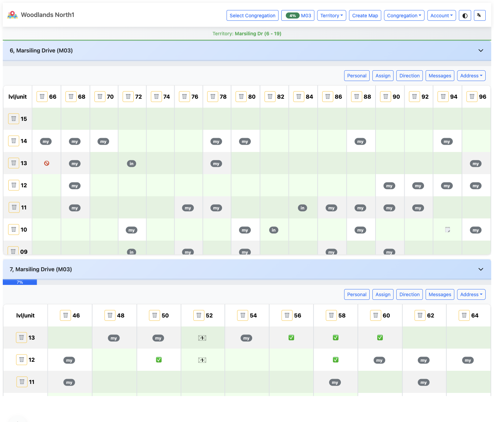
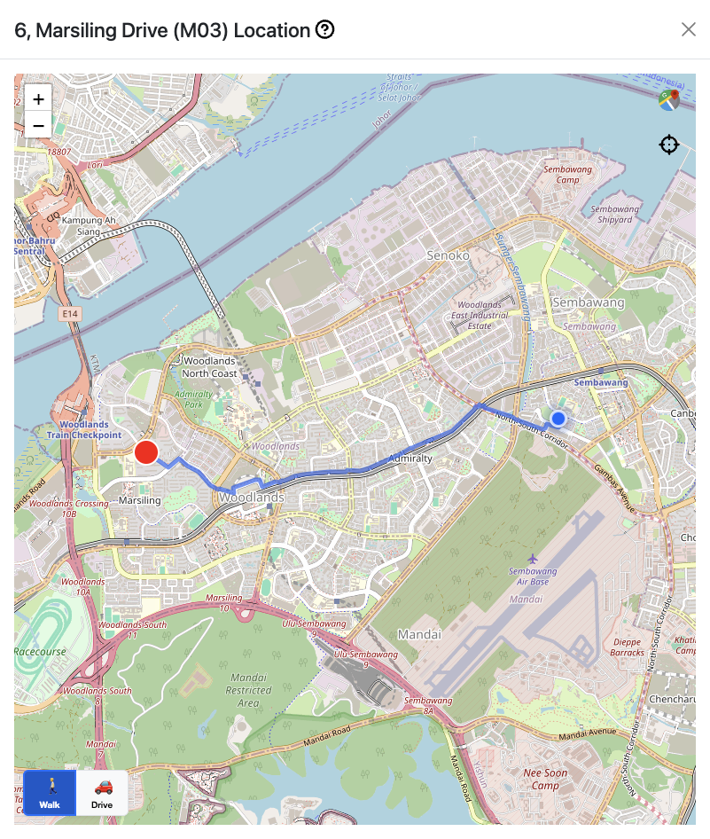
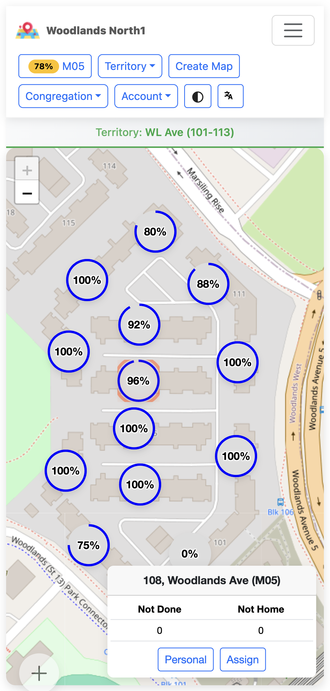
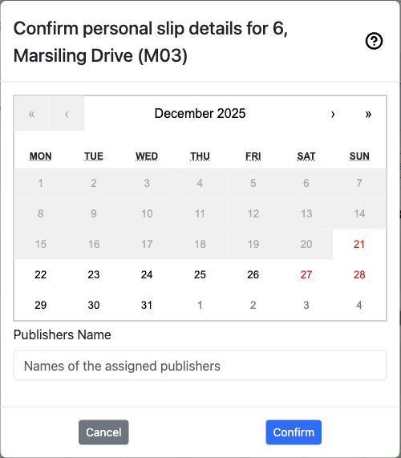

# Ministry Mapper User Guide

## Introduction

Welcome to Ministry Mapper, a modern web-based application designed to help congregations efficiently manage field service territories. This guide will walk you through everything you need to know to get started and make the most of the application.

**What is Ministry Mapper?**

Ministry Mapper is a digital territory management system that replaces traditional paper-based methods. It allows congregations to:

- Organize and assign territories digitally
- Track field service visits in real-time
- Coordinate activities across multiple publishers
- Access territories from any device with internet

**Key Benefits:**

- ✓ Eco-friendly - eliminates paper waste
- ✓ Real-time updates through cloud synchronization
- ✓ Works on any device (desktop, tablet, mobile)
- ✓ Integrated interactive maps for easy navigation
- ✓ Secure role-based access control

## Getting Started

### Creating Your Account


*Figure 1: Registration form for creating a new Ministry Mapper account*

**Step 1: Access the Registration Page**


*Figure 2: Login page with Sign Up option*

1. Visit your congregation's Ministry Mapper URL
2. Click the **"Sign Up"** button on the login page

**Step 2: Choose Registration Method**

| Traditional Sign Up | Google OAuth (Recommended) |
|---------------------|---------------------------|
| Requires email, password (6+ chars, 1 number, 1 capital), and email verification | One-click registration using Google account |
| Manual email verification required | Automatic email verification |
| Need to remember another password | No password to manage |
| Accept Privacy Policy & Terms | Enhanced security through Google |

**Traditional Sign Up:**
1. Fill in: Name, Email, Password, Confirm Password
2. Accept Privacy Policy and Terms of Service
3. Click **"Create Account"**

**Google OAuth Sign Up:**
1. Click **"Sign in with Google"** button under "Or continue with"
2. Select your Google account
3. Grant Ministry Mapper basic profile access
4. Account created automatically

**Step 3: Verify Your Email**


*Figure 3: Email verification message sent after account creation*

1. Check your email inbox for a verification message from Ministry Mapper
2. Click the verification link in the email
3. You'll see a confirmation that your account is verified

**Step 4: Wait for Congregation Access**

After verification:

1. Return to the login page
2. Sign in with your email and password
3. If One-Time Password (OTP) is enabled, check your email for the code


*Figure 4: One-Time Password (OTP) verification screen*


*Figure 5: Email containing the OTP code for login verification*

4. **Important**: You won't see any territories yet - an administrator must grant you access to your congregation first
5. Contact your congregation's territory servant or administrator to request access

### Logging In to Ministry Mapper


*Figure 6: Google OAuth sign-in option for faster and safer authentication*

Once your account is verified and you've been granted congregation access:

**Standard Login:**
1. Navigate to your congregation's Ministry Mapper URL
2. Enter your email address and password
3. Click **"Sign In"**

**Google OAuth Login (Faster):**
1. Click **"Sign in with Google"** button
2. Select your Google account
3. Automatically signed in (no password needed)

**Step 3: Complete OTP Verification (If Enabled)**

If your congregation has enabled One-Time Password security:

1. After entering credentials, you'll see the OTP verification screen
2. Check your email for the verification code
3. Enter the 6-digit code from the email
4. Click **"Verify"** or **"Submit"**
5. Code expires in 5-10 minutes

**Step 4: Access Your Dashboard**

- **Publishers**: You won't see a dashboard - use assignment links sent to you
- **Read-Only, Conductor, Administrator**: You'll see your role-specific dashboard

> **💡 Tip**: Stay logged in on trusted devices for convenience, but always log out on shared computers.

### Understanding User Roles

Ministry Mapper uses a four-tier access control system. Your role determines what features you can access and what actions you can perform.

#### Role Hierarchy

```
Administrator (Full Access)
    ↓
Conductor (Manage Assignments)
    ↓
Read-Only (View Only)
    ↓
Publisher (Link Access Only)
```

---

#### 👤 Publisher

**Access Method**: Via assignment links sent by administrators or conductors

**What Publishers Can Do:**

- ✓ Access territories through shared links
- ✓ View territory maps with interactive mapping
- ✓ Update address status after visits
  - Mark as: Done, Not Home, Do Not Call, Invalid
- ✓ Add visit notes to addresses
- ✓ Track number of "not home" attempts
- ✓ View address details and sequence

**What Publishers Cannot Do:**

- ✗ No dashboard access
- ✗ Cannot view all congregation territories
- ✗ Cannot create or manage territories
- ✗ Cannot access assignment links expire after the set time (default: 24 hours, configurable by congregation administrator)

**Best For**: Regular publishers doing field service

---

#### 👓 Read-Only

**Access Method**: Dashboard login with read-only permissions

**What Read-Only Users Can Do:**

- ✓ View all territories in the congregation
- ✓ See complete address information
- ✓ View territory progress and statistics
- ✓ Access territory maps
- ✓ View congregation messages

**What Read-Only Users Cannot Do:**

- ✗ Cannot modify any territory or address data
- ✗ Cannot create or delete territories
- ✗ Cannot manage assignments
- ✗ Cannot change congregation settings

**Best For**: Overseers who need visibility without editing capabilities

---

#### 🎯 Conductor

**Access Method**: Dashboard login with conductor permissions

**Conductor Capabilities Include:**

- ✓ **Everything Read-Only can do**, PLUS:
- ✓ Create and manage territory assignments
- ✓ Generate assignment links for publishers
- ✓ View all assignment history
- ✓ Access and post congregation messages
- ✓ Manage congregation options (household status types)
- ✓ View territory completion status

**What Conductors Cannot Do:**

- ✗ Cannot create or delete territories
- ✗ Cannot edit address details (addresses, units, floors)
- ✗ Cannot manage user roles or permissions
- ✗ Cannot modify core congregation settings

**Best For**: Field service coordinators and group overseers

---

#### 👑 Administrator (Territory Servant)

**Access Method**: Dashboard login with full administrative permissions

**Administrator Has Complete Control:**

- ✓ **Everything Conductors can do**, PLUS:
- ✓ Create, edit, and delete territories
- ✓ Add, modify, and remove addresses
- ✓ Manage buildings and units
- ✓ Configure congregation settings
  - Set max "not home" tries
  - Configure link expiry times
  - Set up household type options
- ✓ Invite and manage users
- ✓ Assign user roles and permissions
- ✓ Reset territories and addresses
- ✓ Manage geolocation coordinates

**Best For**: Territory servants and those managing the congregation's territory system

---

> **💡 Note**: Contact your congregation administrator if you need your role changed or if you're unsure which role you currently have.

## Main Features

### Dashboard Overview



*Figure 6: Administrator dashboard showing territory selector and main controls*

The dashboard interface varies based on your role:

#### For Publishers

Publishers **do not have dashboard access**. Instead, they:

- Receive assignment links via email or message
- Click the link to access their assigned territory
- Work directly within the territory view
- Links automatically expire after the configured time (default: 24 hours)

#### For Conductors and Administrators

The dashboard provides a comprehensive overview:

**1. Territory Selector** (Top Dropdown)

- Choose which territory to view or manage
- Shows territory code and description
- Quick navigation between territories

**2. Main Action Buttons**

- 📋 **Assignments**: View and manage assignment links
- 💬 **Messages**: Post and view congregation messages
- ⚙️ **Settings**: Access congregation configuration (Administrators only)
- 👥 **Users**: Manage user roles and invitations (Administrators only)

**3. Territory Information Panel**

- Territory code and description
- Progress bar showing completion percentage
- Last updated timestamp
- Total units vs. completed units

**4. Territory View Options**

- 🗺️ **Map View**: Interactive map display
- 📋 **List View**: Tabular display of all addresses

**5. Speed Dial Menu** (Floating Action Button)


*Figure 6a: Speed dial floating action button providing quick access to common actions*

The **➕** button (bottom-right corner) provides quick access to:
- 🗺️ **Map View Mode**: Toggle full-screen map view
- 📋 **Quick Link**: Rapidly create assignment links (Conductors & Administrators)
- Context-aware actions based on current view

---

### Viewing Territories

#### Publisher Territory View


*Figure 7: Publisher view of assigned territory with map and address list*

**Accessing Your Assignment:**

1. Click the assignment link sent by your administrator/conductor
2. The territory automatically loads with:
   - Interactive Google Map showing all addresses
   - Clickable markers for each location
   - List of addresses/units to visit
   - Current progress percentage

**Territory Information Displayed:**

- **Territory Code**: Identifier (e.g., "T-001")
- **Description**: Territory name or area
- **Progress Bar**: Visual completion status
- **Map**: Interactive map with address markers
- **Address List**: All addresses with current status

#### Administrator/Conductor Territory View


*Figure 8: Conductor dashboard with territory selector and management options*

**Viewing a Territory:**

1. Log in to your dashboard
2. Select a territory from the dropdown menu
3. View detailed information:
   - Territory code and description
   - Completion statistics (e.g., "15/20 completed - 75%")
   - Interactive map with all locations
   - Complete address/unit listing with details
   - Management buttons (Edit, Delete, Reset)

**Management Options:**

- ✏️ **Edit Territory**: Change name, code, or description
- 🗑️ **Delete Territory**: Remove entire territory
- 🔄 **Reset Territory**: Clear all address statuses
- ➕ **Add Address**: Create new address in territory

### Working With Addresses

#### Understanding Address Information


*Figure 9: Address card showing all address details and current status*

Each address or unit in Ministry Mapper displays comprehensive information:

**Basic Information:**

- **Address/Unit Number**: Location identifier (e.g., "#05-123")
- **Floor**: Building level (for multi-story properties)
- **Type**: Household classification based on congregation options
  - Examples: Chinese, English, Tamil, Spanish
  - Multiple types can be selected if configured
- **Sequence**: Visit order number

**Status Information:**

- **Status**: Current visit status (see status types below)
- **Not Home Count**: Number of unanswered visit attempts
- **Do Not Call Date**: When DNC was marked (if applicable)

**Activity Tracking:**

- **Notes**: Important information about visits or householder
- **Last Updated**: Date and time of most recent update
- **Updated By**: Username of person who made the last change

---

#### Address Status Types

Ministry Mapper uses five standard status types:

| Status          | Color         | Description            | Usage                                      |
| --------------- | ------------- | ---------------------- | ------------------------------------------ |
| **Not Done**    | White/Default | Not yet visited        | Initial status for all addresses           |
| **Done**        | Green         | Successfully contacted | Householder was home and contacted         |
| **Not Home**    | Yellow/Orange | Nobody answered        | Track up to max tries (configurable)       |
| **Do Not Call** | Red           | Requested no visits    | Householder requested no further contact   |
| **Invalid**     | Gray          | Inaccessible           | Address doesn't exist or cannot be visited |

> **💡 Tip**: Once "Not Home" reaches the maximum tries (set by administrator), the address automatically marks as completed in progress calculations.

---

#### Updating Address Status


*Figure 10: Update status modal showing all fields and options*

**Step-by-Step Process:**

**1. Locate the Address**

- Scroll through the address list
- Or click a marker on the map
- Addresses are grouped by floor for multi-story buildings

**2. Open the Update Modal**

- Click on the address/unit card
- The update modal will open with current information

**3. Update Status** (Required)

Select the appropriate status:

**📗 Done** - When successfully contacted

- Select this when someone answered
- Conversation occurred or literature placed
- Increment "Not Home" count is reset

**🏠 Not Home** - When nobody answered

- Automatically increments "Not Home" count
- System tracks number of attempts
- After reaching max tries, treated as complete

**🚫 Do Not Call** - When requested not to visit


*Figure 11: Do Not Call status update with date selection*

- Select this status
- Optionally set DNC date (defaults to today)
- Add notes explaining reason if appropriate
- **Important**: Respect householder wishes always

**❌ Invalid** - When address is inaccessible

- Address doesn't exist
- Under construction
- Permanently closed
- Cannot be accessed

**4. Update Household Type** (If Available)

If your congregation has configured household types:

- Select single or multiple types
- Examples: Language preferences, special circumstances
- Clear existing types if needed

**5. Add or Update Notes** (Optional but Recommended)

**Best practices:**

- ✓ Focus on property details, not individuals
- ✓ Record access instructions and timing
- ✓ Be concise and respectful
- ✗ Never include personal information about householders
- ✗ Never include sensitive information

**Good Examples:**

- "Gated property - call guardhouse first"
- "Best time: Weekends after 2 PM"
- "Side entrance accessible via driveway"

**Bad Examples:**

- Personal details about residents
- Medical or financial information
- Names or descriptions of individuals

**6. Adjust Not Home Count** (If Needed)

The system automatically tracks not home attempts, but you can manually adjust if necessary.

**7. Set Do Not Call Date** (DNC Status Only)

When marking as Do Not Call:

- System defaults to today's date
- Adjust if needed for specific DNC requests
- Date helps track when to potentially revisit

**8. Update Geolocation** (Administrators Only)

For single-story territories:

- Click "Update Geolocation" button
- Use the map to set precise location
- Helps with navigation and mapping accuracy

**9. Save Changes**

- Review all updates
- Click **"Save"** button
- Changes sync immediately to all users
- Success message confirms update

**10. Delete Property** (Administrators Only - Single-Story)

For private properties that need removal:

- Click "Delete Property" button at bottom
- Confirm deletion
- **Warning**: This action cannot be undone

---

### Using the Map Feature



*Figure 12: Interactive map view showing markers and navigation controls*

Ministry Mapper integrates interactive mapping for intuitive territory navigation.

#### Map Features

**Interactive Markers:**

- Each address is marked on the map
- 🔴 Red marker indicates destination
- 🔵 Blue blinking marker indicates current location
- Click any marker to view/edit that address

**Map Controls:**

- **Zoom**: + and - buttons or pinch gesture
- **Pan**: Click and drag to move around
- **Satellite View**: Toggle between map and satellite imagery
- **Full Screen**: Expand map to full screen (or use Speed Dial → Map View Mode)
- **Center on Territory**: Reset view to show all addresses

**Full-Screen Map View Mode** (Administrators & Conductors):



*Figure 12a: Full-screen map view mode accessed via speed dial menu*

Access via Speed Dial (➕) → Map View icon. Ideal for:
- Route planning before field service
- Territory coverage analysis
- Meeting presentations
- Identifying address clusters

#### Navigation Tips

1. **Before Leaving Home:**

   - View the map to plan your route
   - Identify clusters of addresses
   - Note any special access requirements from notes

2. **In the Field:**

   - Use map to navigate between addresses
   - Follow the sequence numbers for optimal routing
   - Tap markers to quickly update status after each visit

3. **Using with Phone GPS:**
   - Enable location services
   - Map shows your current position
   - Navigate directly to next address
   - Works offline if map tiles cached (limited)

---

### Territory Assignments (Conductors & Administrators)

Ministry Mapper uses a link-based assignment system. Conductors and Administrators create shareable links that publishers use to access territories.

#### Why Link-Based Assignments?

- ✓ **Simple Distribution**: Send links via email, message, or text
- ✓ **Automatic Expiry**: Links expire after set time (default: 24 hours)
- ✓ **No Account Required**: Publishers work directly through the link
- ✓ **Security**: Expired links cannot be accessed
- ✓ **Tracking**: See who accessed what and when

#### Creating an Assignment

**Two Ways to Create Assignments:**


*Figure 13a: Quick link creation interface accessed via speed dial menu*

| Method | Access | Best For |
|--------|--------|----------|
| **Quick Link** | Speed Dial (➕) → Quick Link | Rapid creation for current territory |
| **Standard** | Assignments button → Create New | Full options and customization |

**Step 1: Access Assignment Creation**

- **Quick Link**: Click Speed Dial (➕) → Quick Link icon (pre-fills current territory)
- **Standard**: Click **"Assignments"** → **"Create New Assignment"** or **"+"**

**Step 2: Fill Assignment Form**

| Field | Description | Required |
|-------|-------------|----------|
| **Type** | Normal Assignment or Personal Slip | Yes |
| **Territory** | Select from congregation territories | Yes |
| **Publisher Name** | For tracking (link works without name) | Optional |
| **Link Expiry** | Hours until link expires (default: 24) | Yes |

**Step 3: Generate and Share**

1. Click **"Create Assignment"**
2. System generates a unique link
3. Share the link with the publisher via:
   - Email
   - Text message
   - Instant messaging app
   - Any communication method

**Example Assignment Link:**

```
https://your-ministry-mapper.com/map/abc123xyz456
```

#### Map-Specific Assignment Creation

Create assignments directly from the map view without navigating to the central assignments modal.

**Access:**

1. Navigate to the territory you want to assign
2. Click either:
   - **"Assign"** button - create a normal territory assignment
   - **"Personal"** button - create a personal slip assignment

**Normal Territory Assignment:**


*Figure 13b: Map-specific normal assignment creation form*

Click **"Assign"** to create a normal territory assignment. The form displays:

- Territory information in header
- **Publishers Name** field - enter name(s) of assigned publisher(s)
- **Cancel** and **Confirm** buttons

**Personal Slip Assignment:**



*Figure 13c: Map-specific personal slip creation form with calendar*

Click **"Personal"** to create a personal slip assignment. The form includes:

- Territory information in header
- **Calendar picker** - select the assignment date
- **Publishers Name** field - enter name(s) of assigned publisher(s)
- **Cancel** and **Confirm** buttons

**Benefits:**

- ✓ Quick assignment creation while viewing territory
- ✓ No need to switch to assignments modal
- ✓ Immediate context of the territory being assigned

#### Managing Assignments


*Figure 14: Assignment management modal showing all active assignments across territories*

The Assignment Management interface allows conductors and administrators to view and manage all existing assignments in the congregation.

**View All Assignments:**

1. Click the **"Assignments"** button from the dashboard
2. The Assignments modal opens displaying all active assignment links
3. View assignments for all territories in a centralized list

**Assignment Information Displayed:**

For each assignment, you can see:

- **Territory Code and Location**: Territory identifier with location description (e.g., "187A, Marsiling Road (M01)")
- **Assignment Type**: "Assign" for normal assignments
- **Publisher Name**: Name of the person assigned (e.g., Jon, Erli, Pety)
- **Created Date/Time**: When the assignment was created (e.g., "Dec 22, 2025, 9:38 PM")
- **Expiry Date/Time**: When the assignment link expires (e.g., "Dec 23, 2025, 9:38 AM" or "11:38 PM")
- **Delete Button**: Trash icon (🗑️) to remove individual assignments

**Delete an Assignment:**

1. Locate the assignment in the list
2. Click the **trash icon** (🗑️) button on the right side of the assignment
3. Confirm deletion if prompted
4. The assignment link immediately becomes inaccessible to the publisher

**When to Delete:**

- Territory returned early by publisher
- Wrong link was created or sent
- Publisher no longer needs access
- Assignment needs to be reassigned to someone else
- Security concern or compromise

**Closing the Assignments Modal:**

- Click the **"Cancel"** button at the bottom to close the modal and return to the dashboard

#### Map-Specific Assignment Management

View and manage assignments for individual territories directly from the map view.

**Access:**

1. Navigate to a territory
2. Click either:
   - **"Assign Links"** - for normal territory assignments
   - **"Personal Links"** - for personal slip assignments


*Figure 14a: Assign Links modal for a specific territory*


*Figure 14b: Personal Links modal for a specific territory*

**Information Displayed:**

- Publisher name
- Created and expiry date/time
- Delete button (🗑️) to remove assignments

**When to Use:**

- Check who currently has a territory assigned
- Remove assignments while viewing the territory
- Manage normal and personal assignments separately

#### Best Practices for Assignments

**Before Creating:**

- ✓ Verify the territory is ready (addresses updated, instructions clear)
- ✓ Check congregation settings for default expiry time
- ✓ Plan appropriate expiry duration for territory size

**When Sharing:**

- ✓ Include instructions in your message
- ✓ Remind publisher of expiry time
- ✓ Provide your contact for questions
- ✓ Send during reasonable hours

**Monitoring:**

- ✓ Regular check for expired assignments
- ✓ Clean up old assignments periodically
- ✓ Follow up if territory not returned
- ✓ Track completion rates

---

### Messages and Instructions


*Figure 15: Messages modal showing posted messages with pinning option*

Administrators and Conductors can post messages visible to specific user groups.

#### Message Types

**Publisher Messages:**

- Visible to all publishers with assignment links
- Instructions for field service
- Territory-specific guidance
- General announcements

**Conductor Messages:**

- Visible to Conductors and Administrators
- Coordination information
- Administrative notes
- Planning information

**Administrator Messages:**

- Visible only to Administrators
- System administration notes
- Critical updates
- Management reminders

#### Posting a Message

1. Click **"Messages"** button
2. Click **"New Message"** or **"+"**
3. Type your message
4. Select message type (Publisher/Conductor/Administrator)
5. Optionally **pin** important messages to top
6. Click **"Post"**

#### Message Features

**Pinning:**

- Pin important messages to keep them at the top
- Only one pinned message per type
- Unpin when no longer critical

**Editing:**

- Edit messages after posting
- Updates immediately for all viewers

**Deleting:**

- Remove outdated messages
- Clean up after events pass

**Reading Status:**

- See who has read messages (administrator view)
- Track acknowledgment of important updates

---

### Real-Time Data Synchronization

Ministry Mapper uses PocketBase real-time subscriptions for instant updates:

#### How It Works

**Automatic Synchronization:**

- Changes sync immediately across all connected devices
- No manual refresh needed
- Updates appear instantly for all users viewing same territory

**What Gets Synchronized:**

- ✓ Address status changes
- ✓ New notes and updates
- ✓ Territory progress
- ✓ New messages
- ✓ Assignment changes

**Connection Handling:**

- System automatically detects connection loss
- Reconnects when internet restored
- Shows connection status indicator
- Queues updates if offline (limited)

**Performance:**

- Updates only when territory/page is open
- Automatic cleanup when page closed
- Minimal bandwidth usage
- Optimized for mobile data

> **💡 Note**: For real-time updates to work, keep your browser tab active while working on a territory.

---

### User Management (Administrators Only)


*Figure 16: User management panel showing user list with roles*

Administrators have full control over user accounts and permissions within their congregation.

#### Viewing Users

1. Click your **profile icon** or **user menu**
2. Select **"User Management"** or **"Users"**
3. View complete list of congregation users showing:
   - User name
   - Email address
   - Verification status (✓ verified / ✗ not verified)
   - Current role badge
   - Last activity

#### Inviting New Users


*Figure 17: User invitation dialog for adding new congregation members*

**Step 1: Open Invite Dialog**

1. In User Management, click **"Invite User"** or **"+"**
2. Invite user modal opens

**Step 2: Enter User Information**

- **Email Address**: User's email (must be valid)
- **Role Assignment**: Select one of:
  - Publisher
  - Read-Only
  - Conductor
  - Administrator

**Step 3: Send Invitation**

1. Click **"Send Invite"**
2. System sends invitation email to user
3. Email contains:
   - Link to create account
   - Congregation information
   - Role assignment details
   - Instructions for getting started

**Step 4: User Completes Registration**

- User receives email
- Clicks link to sign up
- Creates account with password
- Verifies email address
- Automatically added to congregation with assigned role

#### Changing User Roles


*Figure 18: User details and role management interface*

1. Locate user in the user list
2. Click on the user or **"Edit"** button
3. Select new role from dropdown:
   - **Publisher**: Basic territory access via links
   - **Read-Only**: View-only dashboard access
   - **Conductor**: Can create assignments and manage messages
   - **Administrator**: Full control
4. Click **"Save"** or **"Update"**
5. Changes take effect immediately

> **⚠️ Important**: Users must log out and log back in to see their new permissions reflected.

#### Removing User Access

**Temporary Removal:**

1. Change user's role to **"No Access"** or **"Delete Access"**
2. User loses all permissions
3. Account remains but cannot access congregation data

**Permanent Removal:**

1. Click **"Delete"** button for user
2. Confirm deletion
3. User completely removed from congregation
4. User can be re-invited if needed

#### User Verification Status

**Verified Users (✓):**

- Email address confirmed
- Full access to assigned permissions
- Can log in normally

**Unverified Users (✗):**

- Email not yet confirmed
- Limited or no access
- Need to check email and click verification link

**To Resend Verification:**

- Some systems allow resending verification email
- Or ask user to use "Forgot Password" feature

---

### Congregation Settings (Administrators Only)


*Figure 19: Congregation settings page with all configuration options*

Configure how Ministry Mapper works for your congregation.

#### Accessing Settings

1. Click **"Settings"** button or ⚙️ icon
2. View congregation configuration panel

#### Key Settings

**1. Maximum "Not Home" Tries**

- Default: 1
- Range: 1-4 attempts
- When reached, address considered complete for progress calculation
- Affects when territories show as finished

**Example:** If set to 3:

- First "Not Home": Count = 1
- Second "Not Home": Count = 2
- Third "Not Home": Count = 3, marks complete

**2. Assignment Link Expiry (Hours)**

- Default: 24 hours
- Range: 1-168 hours (1 week)
- How long assignment links remain active
- Applies to newly created links

**3. Congregation Origin/Location**

- Set your congregation's location
- Used for map centering and directions
- Can be city name or coordinates
- Helps with route planning

**4. OTP (One-Time Password)**

- Enable/disable email OTP for login
- Adds extra security layer
- Users receive code via email when logging in
- Recommended for sensitive congregation data

#### Congregation Options (Household Types)


*Figure 20: Congregation options management showing household type configuration*

Configure custom household classification types for your territory.

**What Are Congregation Options?**

- Custom categories for classifying households
- Examples: Language groups (Chinese, English, Tamil)
- Can represent any classification system your congregation uses
- Multiple types can be assigned to single household if configured

**Managing Options:**

1. **View Options**

   - In Settings, find "Congregation Options" section
   - See list of all configured types

2. **Add New Option**

   - Click "Add Option" or "+"
   - Fill in:
     - **Code**: Short identifier (e.g., "CHI", "ENG")
     - **Description**: Full name (e.g., "Chinese", "English")
     - **Is Countable**: Check if should count toward territory progress
     - **Is Default**: Check if should be default selection
     - **Sequence**: Display order number
   - Click "Save"

3. **Edit Option**

   - Click on existing option
   - Modify fields
   - Save changes

4. **Delete Option**
   - Click delete button for option
   - Confirm deletion
   - **Warning**: Affects all addresses using this type

**Option Flags:**

**Is Countable:**
- Controls whether addresses with this type count toward territory progress
- **Checked**: Included in progress calculation (e.g., Chinese, English, Tamil)
- **Unchecked**: Excluded from progress (e.g., Business, Under Construction)
- Example: 100 total addresses, 10 marked "Business" (not countable) = progress based on 90 addresses only

**Is Default:**
- Auto-selects this type when creating new addresses
- Only one option should be default
- Use for your most common household type

**Sequence:**
- Controls display order in dropdown menus
- Lower numbers appear first (1, 2, 3...)
- **Managed by drag and drop** in settings - simply drag options to reorder
- Affects order in address household dropdowns
- Tip: Order from most common to least common

**Multiple Selection Configuration:**

- Enable if households can have multiple types
- Example: Household speaks both Chinese and English
- When disabled, only one type per household

#### Map Configuration


*Figure 34: Advanced map configuration options for administrators*

Configure how maps are displayed and behave in your congregation. Administrators have access to powerful map management functions for territory maintenance and organization.

**To Access Map Configuration:**

1. Go to **Settings** (Administrators only)
2. Select a territory from the dropdown
3. Open the map view for the selected territory
4. Access the map configuration menu (typically via a settings icon or menu)

**Available Map Configuration Functions:**

**1. Change Location**
   - Relocate a map marker to a different address
   - Updates the geographical location of a territory unit
   - Useful when addresses have changed or initial location was incorrect
   - Simply select the new location on the map

**2. Change Territory**
   - Move an address or unit to a different territory
   - Helps reorganize territory boundaries
   - Useful for balancing territory sizes
   - Maintains all address data and history during transfer

**3. Change Sequence**
   - Modify the visit order number for an address
   - Optimizes the route for field service efficiency
   - Lower numbers are visited first
   - Helps create logical visiting patterns

##### Update Map Sequence (Drag & Drop)


*Drag and drop interface for reordering all map sequences in a territory*

**Access:** Address menu → "Change Sequence"

**How It Works:**
1. Each card shows an address with current sequence number
2. Drag and drop to reorder - numbers update automatically
3. Click **"Save"** to apply or **"Cancel"** to discard

**Best Practices:**
- Minimize backtracking by grouping nearby addresses
- Group floors together in multi-story buildings
- Create logical flow from one end to the other
- Review map view after sequencing

**4. Rename**
   - Change the name or identifier of an address/unit
   - Update building names or unit numbers
   - Keeps data current with real-world changes
   - Useful for correcting initial entry errors

**5. Add Unit No.**
   - Add new unit numbers to existing addresses
   - Expand multi-story buildings with additional units
   - Useful when new apartments are added to a building
   - Maintains building structure organization

**6. Add Higher Floor**
   - Extend a building upward with additional floors
   - For buildings that have been expanded or initially underestimated
   - Automatically creates units for new floors based on building pattern
   - Helps keep territory data current with construction changes

**7. Add Lower Floor**
   - Add floors below the current lowest floor
   - Useful for basement levels or newly accessible lower floors
   - Can add negative floor numbers (e.g., B1, B2)
   - Maintains consistent floor numbering system

**8. Reset Status**
   - Clear the status of an address back to "Not Done"
   - Removes "Done" and "Not Home" statuses only
   - Does NOT remove "Do Not Call" or "Invalid" statuses
   - Preserves notes and other address information
   - Useful when restarting work on a previously completed address
   - Does not affect other addresses in the territory

**9. Delete**
   - Permanently remove an address, unit, or floor from the territory
   - Cannot be undone - use with caution
   - Helpful for removing duplicate entries or non-existent addresses
   - Confirm carefully before deleting

**Common Use Cases:**
- Correcting errors: Rename and Change Location
- Territory rebalancing: Change Territory
- Building updates: Add Higher/Lower Floor
- Route optimization: Change Sequence
- Data cleanup: Delete duplicates
- Seasonal updates: Reset Status

> **⚠️ Warning**: Changes affect all users immediately. Delete is permanent and cannot be undone.

---

### Territory Management (Administrators Only)


*Figure 21: Territory creation interface for adding new territories*

Administrators have full control over creating, editing, and managing territories.

#### Creating a New Territory

**Step 1: Access Territory Creation**

1. Click the **territory selector** dropdown
2. Select **"Create New Territory"** or **"New Territory"**
3. Territory creation form opens

**Step 2: Enter Territory Information**

- **Territory Code**: Short identifier (e.g., "T-001", "M-12", "W-05")
  - Keep it short and meaningful
  - Use consistent naming convention
  - Maximum recommended: 10 characters
- **Description**: Full name or area description
  - Examples: "Downtown Commercial", "Northside Residential"
  - Be descriptive for easy identification
  - Maximum recommended: 100 characters

**Step 3: Create**

1. Click **"Create Territory"**
2. New territory is created and selected
3. Ready to add addresses

#### Editing Territory Details

**Change Territory Code:**

1. Select the territory
2. Click ✏️ **"Edit"** or **"Change Territory Code"**
3. Enter new code
4. Save changes
5. **Warning**: Update any references to old code

**Change Territory Description:**

1. Select territory
2. Click **"Change Territory Name"** or edit option
3. Update description
4. Save changes

**Change Territory Sequence:**

##### Update Territory Sequence (Drag & Drop)


*Drag and drop interface for reordering all territories in the congregation*

**Access:** Territory dropdown → "Change Sequence"

**How It Works:**
1. Each card shows territory code and description
2. Drag and drop to reorder - sequence numbers update automatically
3. Click **"Save"** to apply or **"Cancel"** to discard
4. Controls order in selection dropdowns and lists

**Best Practices:**
- Organize by geographical proximity
- Group by type (residential, commercial, business)
- Consider field service group assignments
- Use for territory rotation planning

#### Territory Configuration Options


*Territory dropdown menu showing configuration options*

Administrators can access territory configuration options through the **Territory dropdown** button in the top navigation bar. Click the button to reveal the following options:

**Available Options:**

- **Create New**: Create a new territory from scratch
- **Change Code**: Modify the territory's unique identifier
- **Change Name**: Update the territory description
- **Change Sequence**: Reorder how territories appear in the selection list
- **Delete Current**: Permanently remove the currently selected territory
- **Reset Status**: Clear all address statuses back to "Not Done"

These options provide quick access to common territory management tasks without navigating through multiple menus.

#### Territory Operations

**Reset Territory:**


*Figure 22: Territory operations and management interface*

Resets all addresses in territory to "Not Done" status:

1. Select territory
2. Click **"Reset Territory"** button
3. Confirm action (this clears all visit data!)
4. All addresses return to "Not Done"
5. Not home counts reset to 0
6. Notes are preserved
7. Progress resets to 0%

**Use When:**

- Territory fully worked and ready to reassign
- Starting new round of visits
- Cleaning up test data

**⚠️ Warning**: Cannot be undone. All status updates will be lost.

**Delete Territory:**


*Figure 23: Territory selection list showing all available territories*

Permanently removes territory and all its data:

1. Select territory to delete
2. Click **"Delete Territory"** button
3. Read warning message carefully
4. Type confirmation if required
5. Confirm deletion

**Deletes:**

- Territory record
- All addresses in territory
- All units and floors
- All assignment history
- All related data

**⚠️ Critical Warning**: This action CANNOT be undone. Consider exporting data first.

---

### Address Management (Administrators Only)


*Figure 24: Address management interface for private/single-story properties*

Administrators can add and manage addresses within territories.

#### Address Types

Ministry Mapper supports two types of addresses:

**1. Public Addresses (Multi-Story)**

- Apartment buildings, condominiums
- Multiple floors and units
- Examples: HDB flats, apartment complexes
- Each floor has multiple units

**2. Private Addresses (Single-Story)**

- Individual houses, shophouses
- Single properties with one address
- Examples: Landed properties, standalone buildings
- No floor/unit structure

#### Adding a Public Address (Multi-Story)

**Step 1: Initiate Creation**

1. Select territory
2. Click **"Add Address"** or **"+"** button
3. Select **"Public Address"** type

**Step 2: Enter Building Information**

- **Postal Code/Address**: Building identifier
  - Enter postal code or street address
  - System may auto-populate location
  - Used for geocoding and map display
- **Building Name**: Optional building name
  - Examples: "Block 123A", "Sunny Heights"
  - Helps publishers identify building

**Step 3: Configure Floors**


*Figure 25: Multi-story building management with floor and unit organization*

- **Start Floor**: Lowest floor number
  - Can be negative for basement levels
  - Examples: -2 (B2), 1 (Ground), 0
- **Top Floor**: Highest floor number
  - Maximum: 50
  - Examples: 10, 25, 40
- **Floor Selection**: Choose specific floors
  - Skip floors with no units (e.g., mechanical floors)
  - Typical: All floors from start to top

**Step 4: Configure Units**

- **Units Per Floor**: Number of units on each floor
  - Examples: 8, 12, 16
  - Creates units automatically
- **Unit Number Format**: How to number units
  - Pattern: Floor + unit (e.g., 01-01, 01-02)
  - Custom: Manually enter unit numbers later

**Step 5: Create and Populate**

1. Click **"Create"**
2. System generates all floors and units
3. Address appears in territory with all units

**Example:**

- Building: Block 123
- Floors: 1 to 12
- Units per floor: 8
- Result: 96 units created (12 floors × 8 units)

#### Adding a Private Address (Single-Story)

**Step 1: Initiate Creation**

1. Select territory
2. Click **"Add Address"** or **"+"**
3. Select **"Private Address"** type

**Step 2: Enter Property Information**

- **Property Postal/Address**: Unique identifier
  - Street address or postal code
  - Each property is one record
- **Property Name**: Optional house name
  - Examples: "123 Main Street", "Villa Sunshine"

**Step 3: Set Location (Optional)**

- Click **"Set Geolocation"**
- Use map to pinpoint exact location
- Helps with navigation
- Can be updated later

**Step 4: Create**

1. Click **"Create Property"**
2. Single address unit created
3. Appears in territory list

#### Managing Existing Addresses

**Edit Address Name:**

1. Select territory with address
2. Click edit option for address
3. Update name/postal
4. Save changes

**Change Postal Code:**

1. Access address edit mode
2. Update postal code field
3. May affect geocoding
4. Save and verify map location

**Reset Address:**

- Clears all unit statuses in address
- Notes preserved
- Use when address fully worked

**Delete Address:**

- Removes entire address and all units
- Cannot be undone
- Confirm carefully before deleting

#### Managing Units (Public Addresses Only)

**Add Units:**

1. Select address
2. Click **"Add Units"**
3. Specify unit numbers to add
4. Units created automatically

**Delete Units:**

1. Click on specific unit
2. Click **"Delete Unit"** button in modal
3. Confirm deletion
4. Unit removed from address

**Change Unit Sequence:**

1. Open unit edit modal
2. Update sequence number
3. Affects visit order
4. Lower numbers visited first

**Add/Delete Floors:**

1. Access floor management
2. Add new floor numbers
3. Or remove entire floors
4. All units on floor affected

**Update Unit Geolocation:**

- Set specific coordinates for unit
- Useful for large buildings
- Helps with precise navigation
- Optional feature

---

---

## Mobile Usage


*Figure 26: Mobile-responsive interface optimized for field service*

### Using Ministry Mapper on Your Phone

Ministry Mapper is fully responsive and optimized for mobile devices, making it perfect for field service.

#### Accessing on Mobile

**Browser Access:**

1. Open your mobile browser:
   - **iOS**: Safari, Chrome
   - **Android**: Chrome, Firefox, Samsung Internet
2. Navigate to your congregation's Ministry Mapper URL
3. Log in or click assignment link
4. Interface automatically adapts to your screen size

**Features on Mobile:**

- ✓ Touch-friendly buttons and controls
- ✓ Swipe gestures for navigation
- ✓ Optimized layouts for small screens
- ✓ Larger tap targets for easy selection
- ✓ Full access to all desktop features
- ✓ Interactive map integration with GPS

#### Progressive Web App (PWA) Installation


*Figure 27: Full-screen map view mode available in PWA installation*

Install Ministry Mapper as an app for better performance:

**Benefits of Installing:**

- 🚀 Faster loading with cached resources
- 📱 App icon on home screen
- 🎯 Full-screen experience (no browser UI)
- ⚡ Improved performance
- 🔔 Better integration with device

**iOS Installation (Safari):**

1. Open Ministry Mapper in Safari
2. Tap the **Share** button (📤)
3. Scroll down and tap **"Add to Home Screen"**
4. Edit name if desired
5. Tap **"Add"**
6. App icon appears on home screen

**Android Installation (Chrome):**

1. Open Ministry Mapper in Chrome
2. Tap the menu button (⋮)
3. Select **"Install app"** or **"Add to Home Screen"**
4. Confirm installation
5. App icon appears on home screen or app drawer

**Using the Installed App:**

- Launch from home screen like any app
- No browser address bar
- Seamless app experience
- Updates automatically

#### Mobile Best Practices

**Before Going Out:**

1. ✓ Check assignment link hasn't expired
2. ✓ Review territory and map
3. ✓ Note any special instructions
4. ✓ Ensure stable internet connection
5. ✓ Fully charge your device
6. ✓ Consider portable charger

**While in Field Service:**

1. ✓ Update addresses immediately after visits
2. ✓ Add notes while information is fresh
3. ✓ Use GPS navigation on map
4. ✓ Follow sequence numbers for efficient routing
5. ✓ Save battery by dimming screen when not needed

**Data Usage Tips:**

- Ministry Mapper uses minimal data
- Map tiles may use more data
- Most updates are < 1KB each
- Suitable for mobile data usage

### Offline Capabilities and Limitations

**Internet Connection Required:**

Ministry Mapper requires active internet for:

- ✗ Loading territory data
- ✗ Saving status updates
- ✗ Real-time synchronization
- ✗ Displaying maps
- ✗ User authentication

**Limited Offline Features:**

- Static assets cached (app shell)
- Previously loaded territory may display
- **Cannot make updates offline**
- **Updates not queued for later sync**

**Handling Connection Loss:**

- System detects connection loss
- Displays connection status warning
- Automatically reconnects when available
- Resume work when connection restored

**Recommendations:**

- ✓ Ensure reliable connection before starting
- ✓ Test connection at territory location
- ✓ Have backup plan for no-internet areas
- ✓ Consider portable WiFi hotspot if needed
- ✓ Update addresses while connection is active

---

---

## Account Settings and Profile

### Personal Profile Management


*Figure 28: Login interface for accessing your Ministry Mapper account*

**Accessing Your Profile:**

1. Click your **profile name/icon** (top right corner)
2. Select **"Profile"** from dropdown menu
3. View and manage your account settings

**Available Profile Options:**

- View account information (name, email)
- Change password
- View congregation membership
- Access user management (Administrators only)
- Log out

### Changing Your Password

**Security Requirements:**

- Minimum 6 characters
- At least one number
- At least one capital letter
- Must match confirmation

**Steps to Change:**

1. Go to your profile
2. Click **"Change Password"**
3. Enter your **current password**
4. Enter **new password**
5. **Confirm new password**
6. Click **"Save"** or **"Change Password"**
7. Success message confirms change

> **💡 Tip**: Use a strong, unique password. Consider using a password manager.

### Password Recovery


*Figure 29: Password recovery page for resetting forgotten passwords*

Forgot your password? Easy recovery process:

1. Go to login page
2. Click **"Forgotten your password?"** link
3. Enter your **registered email address**
4. Click **"Continue"** or **"Send Reset Link"**
5. Check your email inbox


*Figure 30: Password reset email with secure link to create new password*

6. Click the password reset link (valid for limited time)
7. Create a new password meeting requirements
8. Confirm new password
9. Log in with new password

**If you don't receive the email:**

- Check spam/junk folder
- Verify you entered correct email
- Wait a few minutes and try again
- Contact administrator if issues persist

### Language Selection


*Figure 31: Language selection interface showing all supported languages*

Ministry Mapper supports multiple languages for international congregations.

**Supported Languages:**

- 🇬🇧 English (en)
- 🇯🇵 Japanese (ja / 日本語)
- 🇰🇷 Korean (ko / 한국어)
- 🇨🇳 Chinese (zh / 中文)
- 🇮🇩 Indonesian (id / Bahasa Indonesia)
- 🇲🇾 Malay (ms / Bahasa Melayu)
- 🇮🇳 Tamil (ta / தமிழ்)

**How Language is Determined:**

- Automatically detected from browser language settings
- Uses your operating system's language preference
- No manual selection needed in most cases

**To Change Language:**


*Figure 32: Theme and appearance settings including language preferences*

Change browser language settings (Chrome: Settings → Languages | Safari: System Preferences → Language & Region | Firefox: Settings → General → Language), then refresh Ministry Mapper. All interface elements, messages, and help text are fully translated.

### Appearance and Theme Settings

Ministry Mapper supports both light and dark themes to suit your preference and reduce eye strain.

**Changing Theme:**

Profile icon → Theme/Appearance settings → Select:
- **Light Mode**: Bright interface for daytime
- **Dark Mode**: Reduced brightness for low-light (saves battery on OLED)
- **System Default**: Matches device settings automatically

---

## Best Practices

### For Publishers

| Phase | Best Practices |
|-------|---------------|
| **Before Starting** | Review territory on map • Check notes/instructions • Plan route using sequences • Note "Do Not Call" addresses • Ensure device charged |
| **During Service** | Update immediately after each visit • Add detailed, respectful notes • Follow sequence numbers • Use map for navigation • Mark "Not Home" accurately |
| **After Completing** | Review all updates • Add final observations • Notify administrator if complete • Report address issues |

### For Conductors

- Set appropriate link expiry times based on territory size
- Include publisher names for tracking
- Clean up expired assignments regularly
- Monitor territory completion and follow up on overdue assignments
- Post clear messages and instructions

### For Administrators

| Area | Best Practices |
|------|---------------|
| **Territory Setup** | Consistent naming • Short, meaningful codes • Clear descriptions • Verify map locations • Logical sequences |
| **Data Management** | Regular cleanup • Reset completed territories • Verify accuracy • External backups • Train users |
| **User Management** | Appropriate role assignment • Remove inactive users • Prompt response to requests • Clear communication |

### General Principles

- **Plan Ahead**: Review before going out
- **Work Systematically**: Complete one section at a time
- **Update Promptly**: Don't wait to record information
- **Communicate Clearly**: Write understandable, respectful notes
- **Be Thorough**: Cover all addresses persistently
- **Stay Flexible**: Adapt to territory needs

---

## Troubleshooting Common Issues

### Login Problems

| Issue | Symptoms | Solutions |
|-------|----------|-----------|
| **Incorrect Password** | "Invalid credentials" error | Verify email • Check Caps Lock • Use "Forgot Password" → Reset via email |
| **Account Not Verified** | "Email not verified" message | Check inbox/spam for verification email • Click link • Request new if expired |
| **No Congregation Access** | Logged in but no territories shown | Contact administrator to invite you and assign role • Log out/in after access granted |
| **OTP Issues** | Not receiving/invalid OTP code | Check spam • Codes expire in 5-10 minutes • Request new code • Verify email address |

---

### Data Update Problems

| Issue | Symptoms | Solutions |
|-------|----------|-----------|
| **Changes Not Saving** | Save doesn't persist, disappears after refresh | Check internet connection • Refresh page (Ctrl/Cmd + R) • Clear browser cache • Try different browser • Check for concurrent editing |
| **Real-Time Updates Not Appearing** | Changes by others not showing | Ensure active internet • Keep page open • Refresh to force update • Check connection status |

---

### Map and Navigation Issues

| Issue | Symptoms | Solutions |
|-------|----------|-----------|
| **Map Not Loading** | Gray box, error, frozen map | Refresh page (F5) • Wait 10-15 seconds • Check internet speed • Clear cache • Try different browser • Enable JavaScript |
| **Incorrect Location** | Markers misplaced | Administrators: Update geolocation • Verify postal code • Use "Update Geolocation" • Use lat/long if needed |
| **Directions Not Working** | Navigation issues | Verify congregation origin location • Check address has valid coordinates |

---

### Assignment Link Issues

| Issue | Symptoms | Solutions |
|-------|----------|-----------|
| **Link Expired** | "Link has expired", 404 error | Contact administrator/conductor for new link (links expire after set time, typically 24 hours - this is a security feature) |
| **Link Not Working** | Won't open, error message | Ensure entire link copied (check for line breaks) • Copy-paste into browser (don't type) • Verify not expired • Contact administrator |

---

### Permission and Access Issues

| Issue | Symptoms | Solutions |
|-------|----------|-----------|
| **Permission Denied** | "Insufficient permissions", greyed out features | Verify your role with administrator • Log out, clear cache, log back in • Request role upgrade if needed |
| **Wrong Congregation Data** | Unfamiliar territories/data | Verify correct account • Check congregation selector • Log out/in • Contact administrator |

---

### Performance Issues

| Issue | Symptoms | Solutions |
|-------|----------|-----------|
| **Slow Loading** | Long load times, lag, delays | Check internet speed • Close unnecessary tabs • Clear cache • Restart browser • Try different time • Report if persistent |
| **Crashes/Freezes** | App stops responding | Refresh page • Clear cache/cookies • Update browser • Try different browser • Restart device • Check memory |

---

### Browser Compatibility

#### Browser Compatibility

**Supported:** Chrome, Firefox, Safari, Edge (latest versions) • iOS Safari (iOS 13+) • Android Chrome

**Not Supported:** Internet Explorer, outdated browsers

**If having issues:** Update browser • Enable JavaScript • Allow cookies • Disable strict tracking prevention • Try different browser

---

## Getting Help and Support

### Support Channels

**1. Your Congregation Administrator**

- **First point of contact** for most issues
- Can help with:
  - Account access and roles
  - Territory questions
  - Assignment links
  - Local configuration

**2. Official Documentation**

- **GitHub Wiki**: https://github.com/rimorin/ministry-mapper/wiki
- Comprehensive guides for all roles
- Setup and security documentation
- FAQ and common solutions

**3. Technical Issues**

- **GitHub Issues**: https://github.com/rimorin/ministry-mapper/issues
- Report bugs and technical problems
- Check existing issues first
- Search for similar problems

### Reporting Problems Effectively

**Include in Your Report:**
- What you were trying to do
- What happened instead (error messages, screenshots)
- Steps to reproduce the problem
- Browser and version
- Device and OS
- Account type (Publisher/Conductor/Administrator)

**Example Good Report:**
```
Issue: Cannot save address status update
Steps: Opened link → Clicked #05-123 → Changed to "Done" → Clicked Save → Error: "Failed to update"
Browser: Chrome 120 | Device: iPhone 12, iOS 17 | Account: Publisher link
Screenshot: [attached]
```

### Emergency Contact

For urgent issues:

- Contact your congregation administrator directly
- Have phone number/email ready
- Explain urgency clearly
- Have relevant details ready

---

---

## Quick Reference

### Keyboard Shortcuts

Ministry Mapper uses standard browser shortcuts:

| Shortcut         | Action                                      |
| ---------------- | ------------------------------------------- |
| `Escape`         | Close open modals/dialogs                   |
| `Tab`            | Navigate between form fields                |
| `Enter`          | Submit forms or confirm actions             |
| `Ctrl/Cmd + R`   | Refresh page                                |
| Standard editing | Copy, paste, select all work in text fields |

### Status Quick Reference

| Status          | Symbol | When to Use                           |
| --------------- | ------ | ------------------------------------- |
| **Not Done**    | ⚪     | Address not yet visited (default)     |
| **Done**        | ✅     | Successfully contacted householder    |
| **Not Home**    | 🏠     | Nobody answered the door              |
| **Do Not Call** | 🚫     | Householder requested no visits       |
| **Invalid**     | ❌     | Address doesn't exist or inaccessible |

### Role Capabilities Quick Reference

| Feature                  | Publisher | Read-Only | Conductor | Administrator |
| ------------------------ | :-------: | :-------: | :-------: | :-----------: |
| View via assignment link |     ✓     |     -     |     -     |       -       |
| View all territories     |     -     |     ✓     |     ✓     |       ✓       |
| Update address status    |     ✓     |     -     |     -     |       ✓       |
| Create assignments       |     -     |     -     |     ✓     |       ✓       |
| Post messages            |     -     |     -     |     ✓     |       ✓       |
| Manage territories       |     -     |     -     |     -     |       ✓       |
| Manage users             |     -     |     -     |     -     |       ✓       |
| Configure settings       |     -     |     -     |     -     |       ✓       |

---


## Privacy and Security

### Protecting Information

Ministry Mapper handles sensitive address and personal information. Please observe these guidelines:

**Account Security:**

- ✓ **Never share login credentials** with anyone
- ✓ **Use strong, unique passwords** (minimum 6 characters with numbers and capitals)
- ✓ **Log out on shared devices** always
- ✓ **Enable OTP if available** for extra security
- ✓ **Report suspicious activity** immediately

**Data Privacy:**

- ✓ **Record only necessary information** in notes
- ✓ **Be respectful and factual** in all descriptions
- ✓ **No sensitive personal data** (medical, financial, etc.)
- ✓ **Follow householder requests** for privacy
- ✓ **Comply with privacy laws** (GDPR, CCPA, local regulations)

**Legal Compliance:**

- ⚠️ **GDPR (Europe)**: Personal data protection requirements
- ⚠️ **CCPA (California)**: Consumer privacy rights
- ⚠️ **LGPD (Brazil)**: Data protection regulations
- ⚠️ **Local Laws**: Check your region's requirements

### What Information is Stored

**User Data:**

- Account details (name, email, verification status)
- Congregation role assignment
- Created/accessed assignment links
- Activity timestamps

**Territory Data:**

- Address and unit information
- Status updates and history
- Notes and visit information
- Geolocation coordinates
- Progress tracking

**System Data:**

- Login sessions
- Real-time subscriptions
- Message history
- Configuration settings

### Data Storage and Security

| Component | Details |
|-----------|---------|
| **Backend** | PocketBase database managed by administrator • Hosting location determined by congregation • Role-based access control |
| **Real-time Sync** | PocketBase subscriptions • Encrypted HTTPS connections • Automatic reconnection • Session management |
| **Client-Side** | Service worker caches static assets only • No sensitive data stored locally • Auto-update on new versions |
| **Administrator Responsibilities** | Implement backup procedures • Conduct security audits • Keep backend updated • Monitor access logs |

---

## Conclusion

Thank you for using Ministry Mapper to support your congregation's field service activities. This modern, web-based solution brings efficiency, collaboration, and environmental benefits to territory management.

### Key Takeaways

| Role | Key Responsibilities |
|------|---------------------|
| **Publishers** | Access via links • Update immediately after visits • Write respectful notes • Follow sequences |
| **Conductors** | Create assignments • Monitor progress • Post messages • Coordinate activities |
| **Administrators** | Configure settings • Manage territories • Assign roles • Ensure security |

### System Features

**Technology Stack:**

- ✓ React 19 + TypeScript frontend
- ✓ PocketBase backend for data management
- ✓ Leaflet with OpenStreetMap for navigation
- ✓ Real-time synchronization
- ✓ Mobile-responsive PWA
- ✓ Multi-language support
- ✓ Role-based access control
- ✓ Sentry error monitoring

**Benefits:**

- 🌱 **Eco-Friendly**: Eliminates paper waste
- ⚡ **Real-Time**: Instant updates across all devices
- 📱 **Mobile-First**: Works on any device with internet
- 🗺️ **Integrated Maps**: Interactive mapping for easy navigation
- 🔒 **Secure**: Role-based permissions and OTP support
- 🌍 **Multi-Language**: Support for 7+ languages
- 💾 **Reliable**: PocketBase backend with real-time sync

---

**Version**: Refer to your deployment's version
**Last Updated**: 2024

For technical support, contact your congregation administrator or visit the GitHub wiki.

---
