# Ministry Mapper User Guide

## Introduction

Welcome to Ministry Mapper, a modern web-based application designed to help congregations efficiently manage field service territories. This guide will walk you through everything you need to know to get started and make the most of the application.

**What is Ministry Mapper?**

Ministry Mapper is a digital territory management system that replaces traditional paper-based methods. It allows congregations to:

- Organize and assign territories digitally
- Track field service visits in real-time
- Coordinate activities across multiple publishers
- Access territories from any device with internet

**Key Benefits:**

- ✓ Eco-friendly - eliminates paper waste
- ✓ Real-time updates through cloud synchronization
- ✓ Works on any device (desktop, tablet, mobile)
- ✓ Publishers can keep recording calls through patchy coverage - updates send themselves when the signal returns
- ✓ Integrated interactive maps for easy navigation
- ✓ Available in eight languages, with light, dark and five colour themes
- ✓ Secure role-based access control

## Getting Started

### Creating Your Account

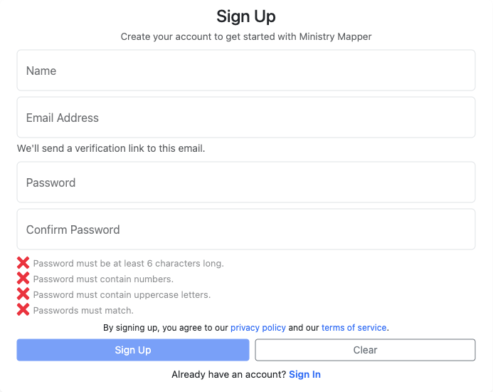

*Figure 1: Registration form for creating a new Ministry Mapper account*

**Step 1: Access the Registration Page**

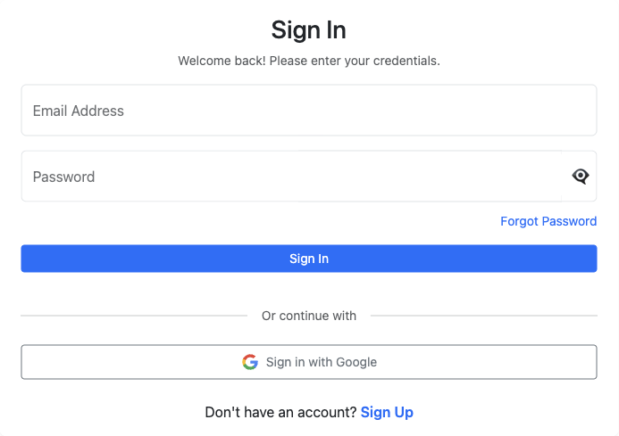

*Figure 2: Login page with Sign Up option*

1. Visit your congregation's Ministry Mapper URL
2. Click the **"Sign Up"** button on the login page

**Step 2: Choose Registration Method**

| Traditional Sign Up | Google OAuth (Recommended) |
|---------------------|---------------------------|
| Requires email and a password of at least 6 characters, plus email verification | One-click registration using Google account |
| Manual email verification required | Automatic email verification |
| Need to remember another password | No password to manage |
| Accept Privacy Policy & Terms | Enhanced security through Google |

**Traditional Sign Up:**
1. Fill in: Name, Email, Password, Confirm Password
2. Watch the live password checklist as you type - it confirms the minimum length (6 characters), whether the password contains a number, whether it contains an uppercase letter, and whether both password fields match
3. Accept Privacy Policy and Terms of Service
4. Click **"Create Account"**

!!! note "About the password rules"
    Only the **6-character minimum** is enforced by the server. The number and uppercase-letter items in the checklist are on-screen guidance to help you pick a stronger password - they will not block you from creating the account.

**Google OAuth Sign Up:**
1. Click **"Sign in with Google"** button under "Or continue with"
2. Select your Google account
3. Grant Ministry Mapper basic profile access
4. Account created automatically

**Step 3: Verify Your Email**

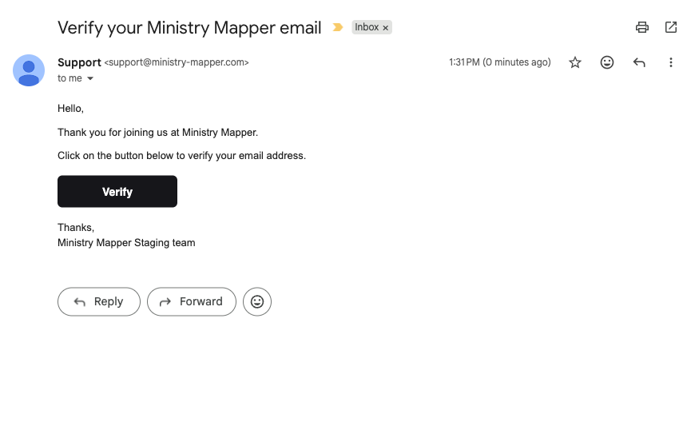

*Figure 3: Email verification message sent after account creation*

1. Check your email inbox for a verification message from Ministry Mapper
2. Click the verification link in the email
3. You'll see a confirmation that your account is verified

**Step 4: Wait for Congregation Access**

After verification:

1. Return to the login page
2. Sign in with your email and password
3. If One-Time Password (OTP) is enabled, check your email for the code

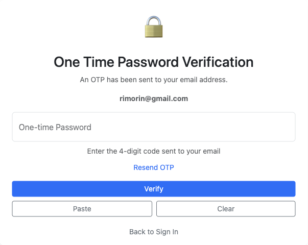

*Figure 4: One-Time Password (OTP) verification screen*

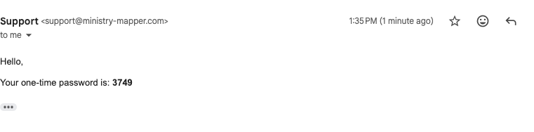

*Figure 5: Email containing the OTP code for login verification*

4. **Important**: You won't see any territories yet - an administrator must grant you access to your congregation first
5. Contact your congregation's territory servant or administrator to request access

### Logging In to Ministry Mapper

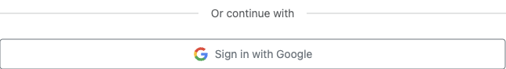

*Figure 6: Google OAuth sign-in option for faster and safer authentication*

Once your account is verified and you've been granted congregation access:

**Standard Login:**
1. Navigate to your congregation's Ministry Mapper URL
2. Enter your email address and password
3. Click **"Sign In"**

**Google OAuth Login (Faster):**
1. Click **"Sign in with Google"** button
2. Select your Google account
3. Automatically signed in (no password needed)

**Step 3: Complete OTP Verification (If Enabled)**

If your congregation has enabled One-Time Password security:

1. After entering credentials, you'll see the OTP verification screen
2. Check your email for the verification code
3. Enter the **4-digit code** from the email - the screen has a **Paste** button if your browser allows clipboard access, plus **Clear** and **Resend OTP**
4. Click **"Verify"** or **"Submit"**
5. The code expires **180 seconds (3 minutes)** after it is issued - use **Resend OTP** to get a fresh one

**Step 4: Access Your Dashboard**

- **Publishers**: You won't see a dashboard - use assignment links sent to you
- **Read-Only, Conductor, Administrator**: You'll see your role-specific dashboard

> **💡 Tip**: Stay logged in on trusted devices for convenience, but always log out on shared computers.

### Understanding User Roles

Ministry Mapper has **three congregation roles** - Read-Only, Conductor and Administrator - plus **one link-based access path** for publishers. Your role determines what features you can access and what actions you can perform.

#### Role Hierarchy

```text
Administrator (Full Access)
    ↓
Conductor (Manage Assignments and Addresses)
    ↓
Read-Only (View Only)
    ↓
Publisher (Map-Link Access Only - not a congregation role)
```

!!! note "Publisher is an access path, not a role"
    A publisher does not need an account, is never given a role, and never appears in **Manage Users**. "Publisher" simply describes someone working from a map link that a conductor or administrator shared with them. Everything they can do comes from holding that link, and it stops working the moment the link expires or is deleted.

---

#### 👤 Publisher

**Access Method**: Via assignment links sent by administrators or conductors

**What Publishers Can Do:**

- ✓ Access territories through shared links
- ✓ View territory maps with interactive mapping
- ✓ Update address status after visits, **including while offline**
  - Mark as: Done, Not Home, Do Not Call, Invalid
- ✓ Add visit notes to addresses
- ✓ Track number of "not home" attempts
- ✓ View address details and sequence
- ✓ Add a missing address on a landed-house map
- ✓ Save a house's location pin with **Use my location**
- ✓ Get walking or driving directions to an address
- ✓ Read and post messages for the map
- ✓ Choose their own language and theme

**What Publishers Cannot Do:**

- ✗ No dashboard access
- ✗ Cannot view all congregation territories
- ✗ Cannot create or manage territories
- ✗ Cannot keep working after the link expires - map links stop working once the expiry time set by the congregation passes (default: 24 hours, configurable by the congregation administrator)

**Best For**: Regular publishers doing field service

---

#### 👓 Read-Only

**Access Method**: Dashboard login with read-only permissions

**What Read-Only Users Can Do:**

- ✓ View all territories in the congregation
- ✓ See complete address information
- ✓ View territory progress and statistics
- ✓ Access territory maps
- ✓ View congregation messages

**What Read-Only Users Cannot Do:**

- ✗ Cannot modify any territory or address data
- ✗ Cannot create or delete territories
- ✗ Cannot manage assignments
- ✗ Cannot change congregation settings

**Best For**: Overseers who need visibility without editing capabilities

---

#### 🎯 Conductor

**Access Method**: Dashboard login with conductor permissions

**Conductor Capabilities Include:**

- ✓ **Everything Read-Only can do**, PLUS:
- ✓ Create and manage territory assignments
- ✓ Generate assignment links for publishers (**Assign** and **Quick Link**)
- ✓ View all assignment history
- ✓ Add a new address and update an existing address (status, household types, notes, location pin)
- ✓ Reset a territory's statuses and delete a territory (permitted by the system - see the note under **Territory Operations**)
- ✓ Access and post congregation messages
- ✓ View territory completion status

**What Conductors Cannot Do:**

- ✗ Cannot create a new territory or a new map
- ✗ Cannot issue **Personal** links (administrators only)
- ✗ Cannot use the map-row **Address** menu (rename, move, resequence, add or delete floors and units)
- ✗ Cannot manage user roles or permissions
- ✗ Cannot change congregation settings or household options

**Best For**: Field service coordinators and group overseers

---

#### 👑 Administrator (Territory Servant)

**Access Method**: Dashboard login with full administrative permissions

**Administrator Has Complete Control:**

- ✓ **Everything Conductors can do**, PLUS:
- ✓ Create, edit, and delete territories
- ✓ Add, modify, and remove addresses
- ✓ Manage buildings and units
- ✓ Configure congregation settings
  - Set max "not home" tries
  - Configure link expiry times
  - Set up household type options
- ✓ Invite and manage users
- ✓ Assign user roles and permissions
- ✓ Reset territories and addresses
- ✓ Manage geolocation coordinates

**Best For**: Territory servants and those managing the congregation's territory system

---

> **💡 Note**: Contact your congregation administrator if you need your role changed or if you're unsure which role you currently have.

## Main Features

### Dashboard Overview

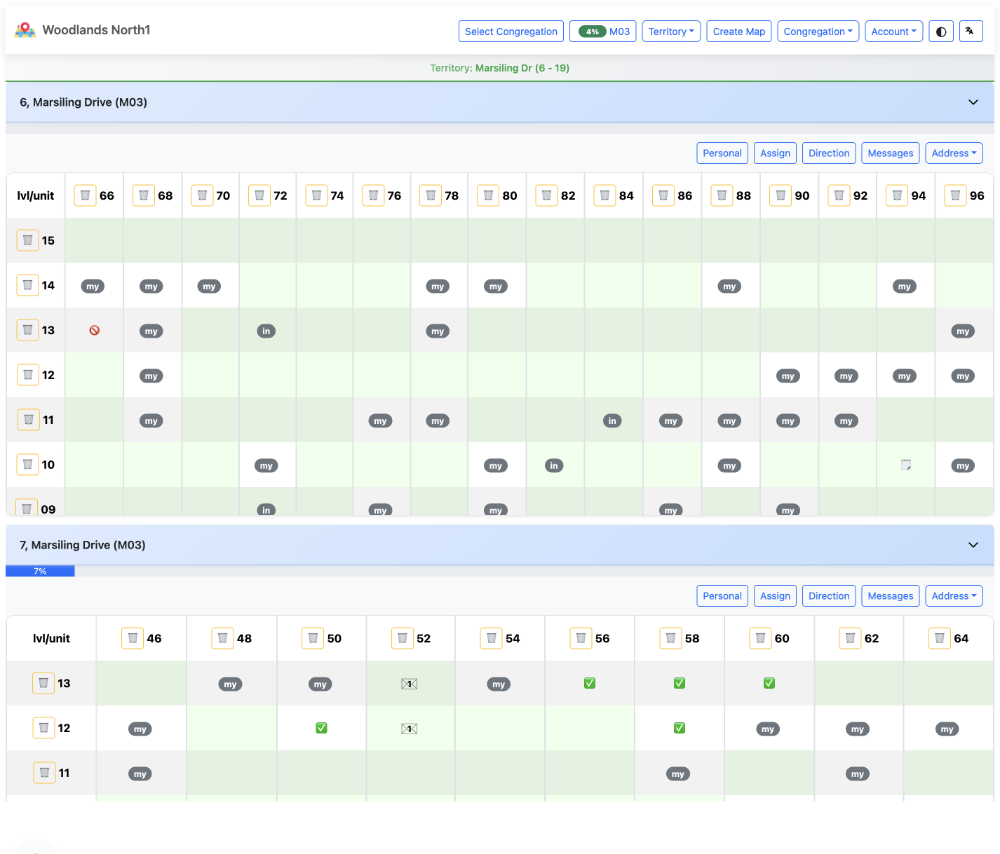

*Figure 7: Administrator dashboard showing territory selector and main controls*

The dashboard interface varies based on your role:

#### For Publishers {#dashboard-for-publishers}

Publishers **do not have dashboard access**. Instead, they:

- Receive map links via email or message
- Tap the link to open their assigned map - no account, no sign-in
- Work directly within the map view
- Links automatically expire after the configured time (default: 24 hours). A countdown in the top bar shows how long is left, turning amber under an hour and red - with a minutes-and-seconds count - under fifteen minutes
- When the time runs out the page becomes **"This link has expired ⌛"**, and asks you to close the tab

The publisher map page has its own bottom navigation: **Messages**, **List View / Map View** (landed-house maps only), **Directions**, **Language** and **Theme**.

#### For Conductors and Administrators

The dashboard provides a comprehensive overview:

**1. Territory Selector** (Top Dropdown)

- Choose which territory to view or manage
- Shows territory code and description
- Quick navigation between territories

**2. Main Action Buttons**

- 📋 **Assignments**: View and manage assignment links
- 💬 **Messages**: Post and view congregation messages
- ⚙️ **Settings**: Access congregation configuration (Administrators only)
- 👥 **Users**: Manage user roles and invitations (Administrators only)

**3. Territory Information Panel**

- Territory code and description
- Progress bar showing completion percentage
- Last updated timestamp
- Total units vs. completed units

**4. Territory View Options**

- 🗺️ **Map View**: Interactive map display
- 📋 **List View**: Tabular display of all addresses

**5. Speed Dial Menu** (Floating Action Button)

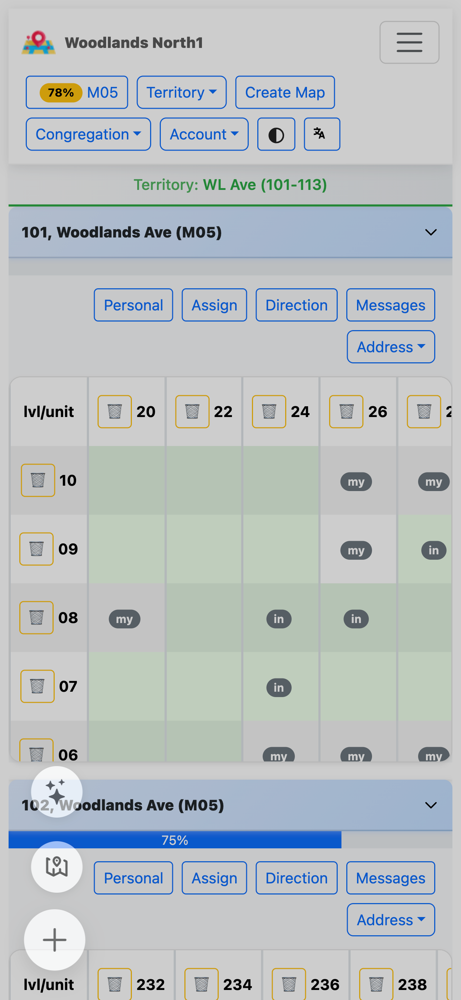

*Figure 8: Speed dial floating action button providing quick access to common actions*

The **➕** button (bottom-right corner) provides quick access to:
- 🗺️ **Map View Mode**: Toggle full-screen map view
- 📋 **Quick Link**: Rapidly create assignment links (Conductors & Administrators)
- Context-aware actions based on current view

---

### Viewing Territories

#### Publisher Territory View

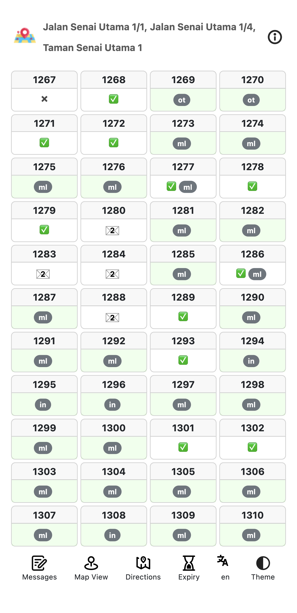

*Figure 9: Publisher view of assigned territory with map and address list*

**Accessing Your Assignment:**

1. Click the assignment link sent by your administrator/conductor
2. The territory automatically loads with:
   - An interactive map (built on Leaflet, using Geoapify-served OpenStreetMap tiles) showing all addresses
   - Clickable markers for each location
   - List of addresses/units to visit
   - Current progress percentage

**Territory Information Displayed:**

- **Territory Code**: Identifier (e.g., "T-001")
- **Description**: Territory name or area
- **Progress Bar**: Visual completion status
- **Map**: Interactive map with address markers
- **Address List**: All addresses with current status

#### Administrator/Conductor Territory View

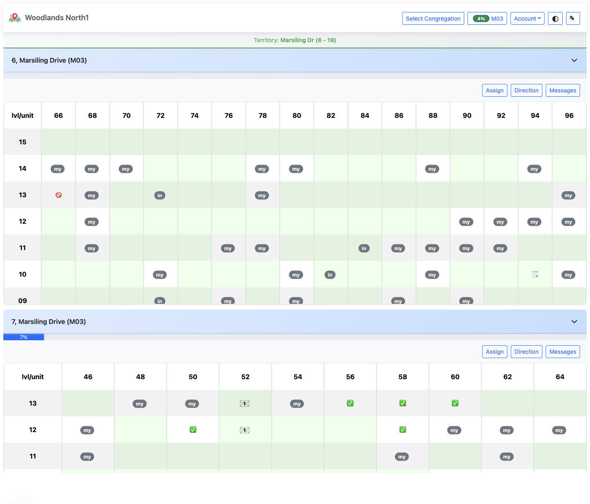

*Figure 10: Conductor dashboard with territory selector and management options*

**Viewing a Territory:**

1. Log in to your dashboard
2. Select a territory from the dropdown menu
3. View detailed information:
   - Territory code and description
   - Completion statistics (e.g., "15/20 completed - 75%")
   - Interactive map with all locations
   - Complete address/unit listing with details
   - Management buttons (Edit, Delete, Reset)

**Management Options:**

- ✏️ **Edit Territory**: Change name, code, or description
- 🗑️ **Delete Territory**: Remove entire territory
- 🔄 **Reset Territory**: Clear all address statuses
- ➕ **Add Address**: Create new address in territory

#### Sorting the Map List

Once a territory is selected and you are in **list** view, a sort button sits next to the list/map toggle in the territory header. It offers three ways to order the maps.

| Sort | What it does | Use it when |
|------|--------------|-------------|
| **Sequence** | The order your congregation arranged the maps in (the default) | You want the familiar, deliberate order - the one Reorder Maps produced |
| **Progress** | Least complete first | You are deciding what still needs attention, or what to assign next |
| **Proximity** | Nearest to you first, with each map's distance shown | You are standing in the territory and want the closest map |

**How to change it:**

1. Select a territory and make sure you are in list view (the sort button only appears there)
2. Tap the sort button - its icon shows the mode currently in use
3. Choose **Sequence**, **Progress** or **Proximity**

**About Proximity:**

- The first time you pick it, your browser asks for permission to use your location. The button shows a spinner while it waits for a position fix.
- Each map then shows its distance from you, as **"450 m"** for anything under a kilometre or **"3.9 km"** above that.
- Maps with no location saved sort to the bottom and show no distance.
- If you decline the permission - or the position cannot be obtained - Ministry Mapper tells you **"Could not get your location. Check location permissions and try again."** and stays on the sort you were using. Nothing is reordered on a guess.

Your choice is remembered **per device**, so the list comes back the way you left it. The one exception: if Proximity was your last choice and the location cannot be obtained when you return, the list quietly falls back to Sequence.

#### Reading the Map List Counts

Under each map's name, up to two counts appear:

| Row | Meaning |
|-----|---------|
| **Not Done** | How many addresses on that map have not been called on at all |
| **Not Home** | How many are sitting on a Not Home status and have not yet used up the congregation's allowed tries |

A count only appears when it is greater than zero, and the whole block disappears when both are zero - so a map showing no counts at all is a map with nothing outstanding. The numbers come from the server, so they are the same for everybody and do not depend on your device having loaded the addresses.

Publishers see the same two numbers on their own map page, underneath the progress bar - but only once the map is nearly finished, written as **"12 not done · 3 not home"**.

### Working With Addresses

#### Understanding Address Information

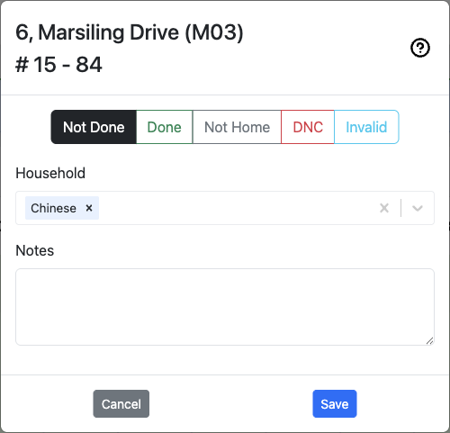

*Figure 11: Address card showing all address details and current status*

Each address or unit in Ministry Mapper displays comprehensive information:

**Basic Information:**

- **Address/Unit Number**: Location identifier (e.g., "#05-123")
- **Floor**: Building level (for multi-story properties)
- **Type**: Household classification based on congregation options
  - Examples: Chinese, English, Tamil, Spanish
  - Multiple types can be selected if configured
- **Sequence**: Visit order number

**Status Information:**

- **Status**: Current visit status (see status types below)
- **Not Home Count**: Number of unanswered visit attempts
- **Do Not Call Date**: When DNC was marked (if applicable)

**Activity Tracking:**

- **Notes**: Important information about visits or householder
- **Last Updated**: Date and time of most recent update
- **Updated By**: Username of person who made the last change

---

#### Address Status Types

Ministry Mapper uses five standard status types:

| Status          | Color         | Description            | Usage                                      |
| --------------- | ------------- | ---------------------- | ------------------------------------------ |
| **Not Done**    | White/Default | Not yet visited        | Initial status for all addresses           |
| **Done**        | Green         | Successfully contacted | Householder was home and contacted         |
| **Not Home**    | Yellow/Orange | Nobody answered        | Track up to max tries (configurable)       |
| **Do Not Call** | Red           | Requested no visits    | Householder requested no further contact   |
| **Invalid**     | Violet        | Inaccessible           | Address doesn't exist or cannot be visited |

> **💡 Tip**: Once "Not Home" reaches the maximum tries (set by administrator), the address automatically marks as completed in progress calculations.

---

#### Updating Address Status

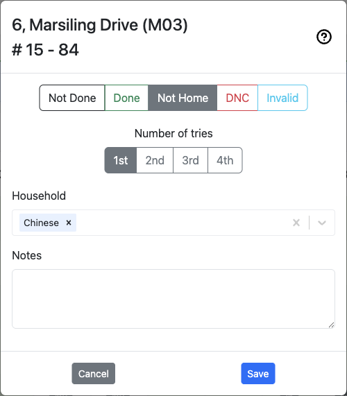

*Figure 12: Update status modal showing all fields and options*

**Step-by-Step Process:**

**1. Locate the Address**

- Scroll through the address list
- Or click a marker on the map
- Addresses are grouped by floor for multi-story buildings

**2. Open the Update Modal**

- Click on the address/unit card
- The update modal will open with current information

**3. Update Status** (Required)

Select the appropriate status:

**📗 Done** - When successfully contacted

- Select this when someone answered
- Conversation occurred or literature placed
- Increment "Not Home" count is reset

**🏠 Not Home** - When nobody answered

- Automatically increments "Not Home" count
- System tracks number of attempts
- After reaching max tries, treated as complete

**🚫 Do Not Call** - When requested not to visit

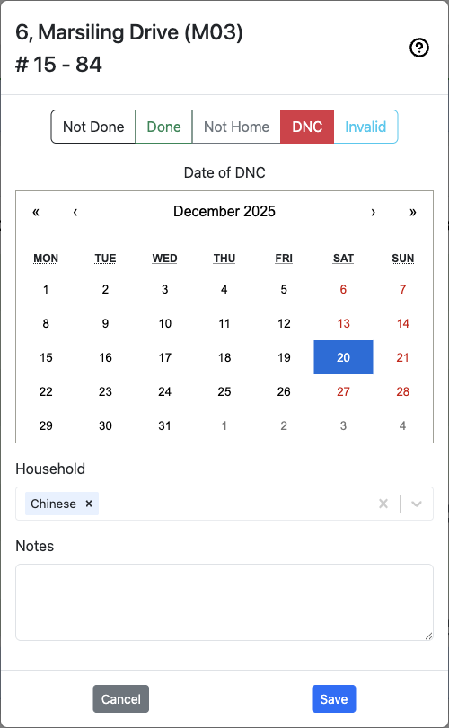

*Figure 13: Do Not Call status update with date selection*

- Select this status
- Optionally set DNC date (defaults to today)
- Add notes explaining reason if appropriate
- **Important**: Respect householder wishes always

**❌ Invalid** - When address is inaccessible

- Address doesn't exist
- Under construction
- Permanently closed
- Cannot be accessed

**4. Update Household Type** (Required, if your congregation uses them)

If your congregation has configured household types:

- Tap the household field to open the picker, then tap the types that apply
- **Done** shows a running count of what you have chosen, for example **"Done (3)"**
- **Cancel** - and pressing Esc, and tapping outside the picker - throws away your changes and leaves the saved value untouched. Only **Done** commits
- Examples: Language preferences, special circumstances

!!! warning "At least one household type is required"
    You cannot save an address with no household type. Leaving it empty shows **"Please select at least one household type."** This applies when you **add** an address and when you **update** one.

    The reason is practical: an address with no household type cannot be counted, so it would never appear as still needing a call - not on the grid, not on the map, and not in the "X to go" count. It would simply be invisible.

    If your congregation has not set up any household types, the field does not appear and nothing is required.

**5. Add or Update Notes** (Optional but Recommended)

**Best practices:**

- ✓ Focus on property details, not individuals
- ✓ Record access instructions and timing
- ✓ Be concise and respectful
- ✗ Never include personal information about householders
- ✗ Never include sensitive information

**Good Examples:**

- "Gated property - call guardhouse first"
- "Best time: Weekends after 2 PM"
- "Side entrance accessible via driveway"

**Bad Examples:**

- Personal details about residents
- Medical or financial information
- Names or descriptions of individuals

**6. Adjust Not Home Count** (If Needed)

The system automatically tracks not home attempts, but you can manually adjust if necessary.

**7. Set Do Not Call Date** (DNC Status Only)

When marking as Do Not Call:

- System defaults to today's date
- Adjust if needed for specific DNC requests
- Date helps track when to potentially revisit

**8. Set the Location Pin** (Landed-House Maps Only)

On landed-house (single-story) maps the update form has a **Location** field - see **Saving a House's Location** below.

**9. Save Changes**

- Review all updates
- Click **"Save"** button
- Changes sync immediately to all users
- Success message confirms update

**10. Delete Property** (Administrators Only - Single-Story)

For private properties that need removal:

- Click "Delete Property" button at bottom
- Confirm deletion
- **Warning**: This action cannot be undone

---

#### Adding a Missing Address

If you notice a physical address is missing from the map, you can add it on the spot without leaving the mapping view:

1. Scroll to the bottom of the address list on the map
2. Tap the **+** card at the end of the list
3. Enter the address details in the form that appears
4. Tap **Save** — the address is immediately added to the map

!!! note
    The **+** card appears on landed-house (single-story) maps and is designed for congregations that are still building their territory records. Newly added addresses are flagged for review by administrators.

!!! warning "Household type is required"
    If your congregation has set up household types, you must pick at least one before the address can be saved. Leaving it blank shows **"Please select at least one household type."** The same rule applies when you update an existing address. An address with no household type cannot be counted, so it would never show up as still needing a call - on the grid or on the map.

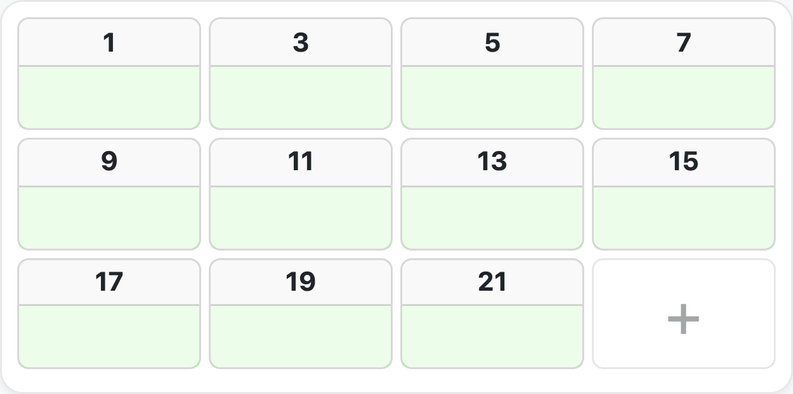

*Figure 14: The **+** card at the end of the address list, used to add a missing address without leaving the map*

---

#### Finishing a Map: the "X to go" Button

The last few addresses on a map are the hardest to find. When a map is nearly done, a floating pill appears in the bottom-right corner of the grid reading **"7 to go"** - the number of addresses that still need a call.

**How to use it:**

1. Tap the pill
2. The grid scrolls to the next address that still needs a call and draws a ring around it
3. Record the call as usual - the ring disappears once that address is done
4. Tap again for the next one

**Things worth knowing:**

- **It only appears near the end.** The button shows up once a map reaches **90% complete**, and disappears at 100%. Early in a map it would just be a list of everything, which is what the grid already is.
- **It goes in the map's own order** - the same order the grid uses, so you are not sent randomly back and forth.
- **It wraps around.** After the last remaining address, the next tap starts again from the first.
- **The ring is a reminder, not a claim.** It marks where the button sent you and clears itself the moment that address is recorded, so a finished map is left unmarked.
- **Switching maps starts the tour over** from the top.

**On multi-floor maps**, a small badge beside each floor number shows how many addresses on that floor still need a call - *"3 still to call on this floor"*. These badges follow exactly the same rule: they appear only in the last stretch of a map, and **never on single-floor maps**, where the floor number carries no information anyway.

---

#### Saving a House's Location

Landed houses do not always sit where a postal code says they do, and a house with no location cannot be shown on the map at all. On landed-house (single-story) maps, the address form has a **Location** field for fixing this.

**Two ways to set the pin:**

| Button | What it does | Best for |
|--------|--------------|----------|
| **Use my location** | Takes the position from your phone, in one tap | You are standing at the house |
| **On map** | Opens a map you can search, pan and tap to place the pin by hand | You are correcting a pin later, from anywhere |

**Using "Use my location":**

1. Stand at or in front of the house
2. Tap **Use my location**. The button shows a spinner and reads **"Getting location…"** while it waits - a fresh, accurate fix can take several seconds, so give it a moment
3. The coordinates appear in the field
4. Save the address as usual

If it fails you'll see **"Unable to get your current location. Please check your browser settings."** - almost always a location permission that needs granting, or a first fix indoors that never arrived. Step outside and try again, or use **On map**.

**When no pin is set:**

- The field reads **"No pin set"**
- The address is **not shown in Map View at all** - there is no coordinate to draw it at, so it would be invisible or, worse, misplaced
- Map View shows a note in the bottom-left corner: **"4 addresses need a pin"** with **"Tap to set the first"**. Tapping it opens the first unpinned address so you can fix them one after another

!!! tip "Pin as you go"
    The fastest way to get a landed territory fully pinned is to tap **Use my location** at each house while you are already standing there. It costs one extra tap per address and turns Map View from half-empty into a complete picture.

!!! note "This works offline"
    Your position comes from the device, not from the network, so **Use my location** works with no signal. The pin is saved with the rest of your update and sent when you are back online.

---

### Using the Map Feature

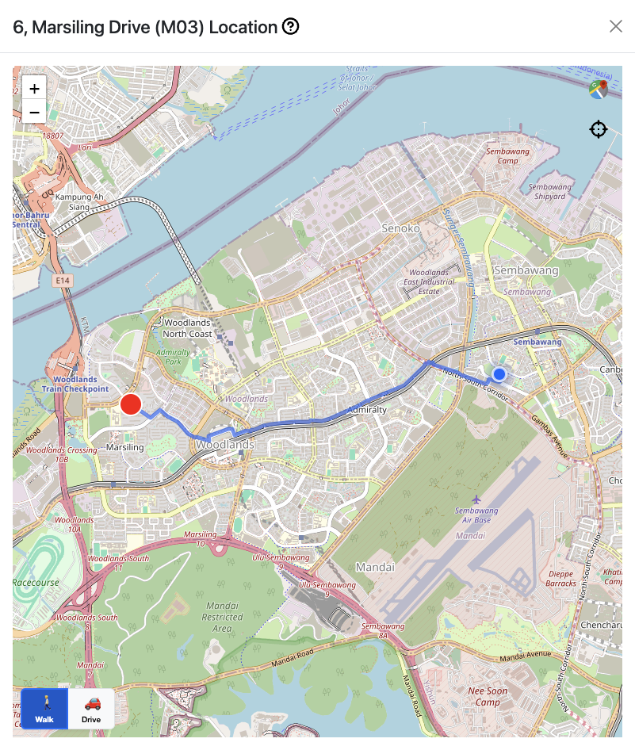

*Figure 15: Interactive map view showing markers and navigation controls*

Ministry Mapper integrates interactive mapping for intuitive territory navigation.

#### Map Features

**Interactive Markers:**

- Each address is marked on the map
- 🔴 Red marker indicates destination
- 🔵 Blue blinking marker indicates current location
- Click any marker to view/edit that address

**Map Controls:**

- **Zoom**: + and - buttons or pinch gesture
- **Pan**: Click and drag to move around
- **Recentre on me**: The crosshair button snaps the view back to your current position
- **Full Screen**: Expand map to full screen (or use Speed Dial → Map View Mode)
- **Center on Territory**: Reset view to show all addresses

!!! note "There is no satellite layer"
    Ministry Mapper draws a single OpenStreetMap-based street map. There is no satellite or aerial imagery to switch to.

**Full-Screen Map View Mode** (Administrators & Conductors):

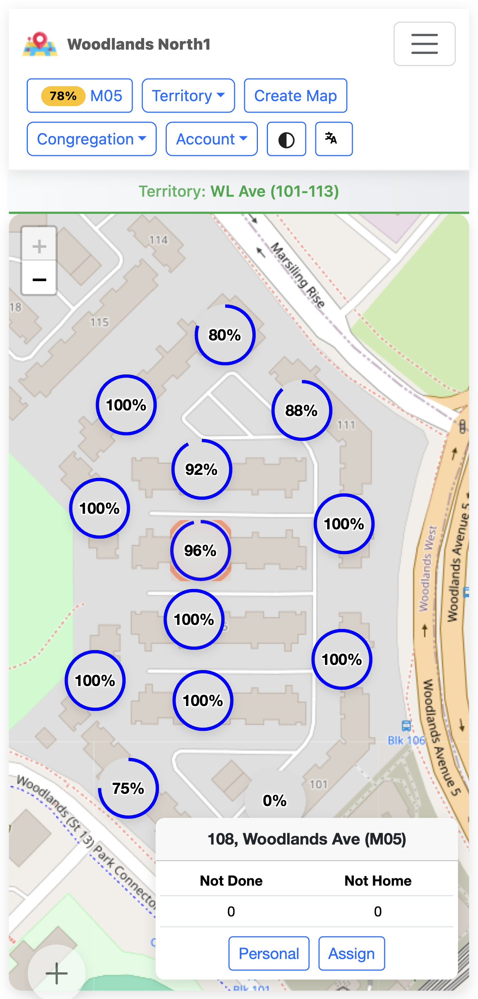

*Figure 16: Full-screen map view mode accessed via speed dial menu*

Access via Speed Dial (➕) → Map View icon. Ideal for:
- Route planning before field service
- Territory coverage analysis
- Meeting presentations
- Identifying address clusters

#### Reading the Map View Markers (Administrators & Conductors)

In Map View each map is drawn as a small round dial rather than a plain pin, so you can read a territory's state without tapping anything. The number in the middle is the map's completion percentage.

| What you see | What it means |
|--------------|---------------|
| **Blue ring around the edge** | Progress - how much of that map is done. The rest of the ring is grey |
| **Green dot at the top** | The map is **assigned** - someone is holding a live link to it |
| **Orange dot at the bottom** | The map has a **personal** link out |
| **No dots at all** | No active links - nobody currently has this map |
| **Grey outline around the marker** | This is the marker you have selected |

Position, not just colour, carries the meaning: green sits at the top and orange at the bottom. That is deliberate - the two colours are close enough in brightness that anyone with a colour-vision difference, or anyone squinting at a phone in sunlight, would struggle to tell them apart on colour alone. Top-versus-bottom is unambiguous.

!!! tip "The Marker Guide"
    Tap the small button in the **top-right corner** of the map for the **MARKER GUIDE** - a short key showing the green dial (Assignment), the orange dial (Personal) and the blue ring (Progress). It is there so you never have to remember which is which.

!!! note "Grey means selected, not personal"
    A selected marker is outlined in **grey**. Selection is something *you* did, not a fact about the territory, so it deliberately uses a neutral colour. Orange means one thing and one thing only: a personal link is out.

**Individual addresses** on a landed-house map use a different, simpler marker: a plain pin, ringed in **green** when the address still needs a call, and in **amber** when the map has reached its final stretch. Addresses with no location pin do not appear - see **Saving a House's Location**.

#### Getting Directions to an Address

Ministry Mapper has a built-in routing service to help you navigate to addresses in your territory:

1. On the map view, tap any address in the list
2. Tap the **Directions** button (or the route icon)
3. Use the toggle in the bottom-left corner to pick your travel mode:
   - 🚶 **Walk** — pedestrian route
   - 🚗 **Drive** — car navigation
4. The route is drawn on the map, and a pill shows the remaining distance and estimated time
5. Your position keeps updating as you move; when you get within about 50 metres the route clears and you'll see **"You've reached your destination"**
6. Two buttons hand the trip off to an external app if you prefer: **Google Maps** and **Waze**

!!! tip
    Use **Walk** mode when working densely populated areas to get more accurate pedestrian routes. Your choice is remembered for next time.

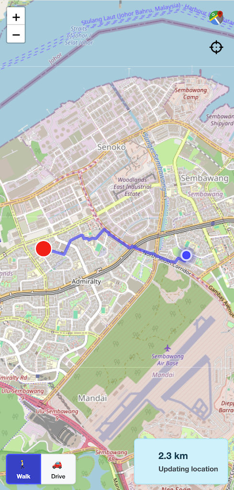

*Figure 17: Walk/Drive routing on the map page, with the destination in red and your position in blue*

#### Navigation Tips

1. **Before Leaving Home:**

   - View the map to plan your route
   - Identify clusters of addresses
   - Note any special access requirements from notes

2. **In the Field:**

   - Use map to navigate between addresses
   - Follow the sequence numbers for optimal routing
   - Tap markers to quickly update status after each visit

3. **Using with Phone GPS:**
   - Enable location services
   - Map shows your current position
   - Navigate directly to next address
   - Works offline if map tiles cached (limited)

---

### Territory Assignments (Conductors & Administrators)

Ministry Mapper uses a link-based assignment system. Conductors and Administrators create shareable links that publishers use to access territories.

#### Why Link-Based Assignments?

- ✓ **Simple Distribution**: Send links via email, message, or text
- ✓ **Automatic Expiry**: Links expire after set time (default: 24 hours)
- ✓ **No Account Required**: Publishers work directly through the link
- ✓ **Security**: Expired links cannot be accessed
- ✓ **Tracking**: See who accessed what and when

#### Creating an Assignment

**Two Ways to Create Assignments:**

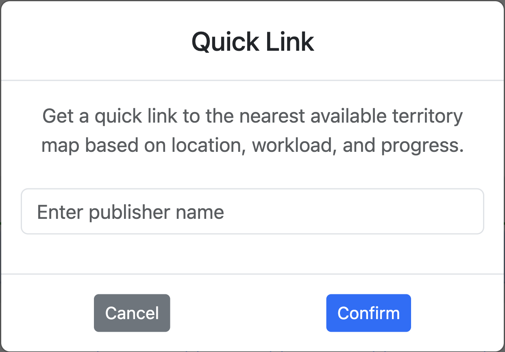

*Figure 18: Quick link creation interface accessed via speed dial menu*

| Method | Access | Best For |
|--------|--------|----------|
| **Quick Link** | Speed Dial (➕) → Quick Link | Rapid creation for current territory |
| **Standard** | Assignments button → Create New | Full options and customization |

**Step 1: Access Assignment Creation**

- **Quick Link**: Click Speed Dial (➕) → Quick Link icon (pre-fills current territory)
- **Standard**: Click **"Assignments"** → **"Create New Assignment"** or **"+"**

**Step 2: Fill Assignment Form**

| Field | Description | Required |
|-------|-------------|----------|
| **Type** | Normal Assignment or Personal Slip | Yes |
| **Territory** | Select from congregation territories | Yes |
| **Publisher Name** | For tracking (link works without name) | Optional |
| **Link Expiry** | Hours until link expires (default: 24) | Yes |

**Step 3: Generate and Share**

Sharing happens in **two steps**, and that is deliberate - see the note below.

1. Confirm the slip details (publisher name, and the date for a personal slip) and submit
2. A **"Map link is ready"** screen appears, showing:
   - The map name and the link type
   - The territory
   - **Assigned to** *(the name you entered)*
   - **Expires** *(the date and time the link stops working)*
   - The map's not-done and not-home counts, so you can see what you are handing over
   - An amber **"Already assigned"** panel if other publishers still hold a live link to this map - it lists up to three names, then "+N more"
3. Tap **Share** to hand the link to the publisher through your phone's own share sheet - message, email, or any app you like. If your browser cannot share, the button says **Copy link** instead and puts the URL on your clipboard.

!!! note "Why two steps?"
    Your phone only lets an app open the share sheet during the split second you actually tapped the button. The old single-step flow had to wait for the server in between, and browsers - Chrome on iPhone especially - silently swallowed the share sheet. Creating the link first, then sharing from the ready screen, means the share sheet always opens.

!!! warning "A map link is a key - treat it like one"
    Map links bypass login. **Anyone who has the link has access** to that map, whether or not they are in your congregation.

    - Send links **directly** to the publisher who needs them - never to a public status or story (WhatsApp Status, for example), a public group, or a social media post.
    - If a link is posted publicly, **remove the post immediately** and tell a conductor or administrator so the link can be deleted and a new one issued.
    - Administrators: shortening the link expiry in **Congregation Settings** shrinks how long a leaked link stays useful.

**Example Assignment Link:**

```text
https://your-ministry-mapper.com/map/k7f2q9m4x1b8d3s6h0n5v2c7t
```

The 25-character code at the end *is* the credential - it is what identifies the assignment. There is no separate password.

#### Map-Specific Assignment Creation

Create assignments directly from the map view without navigating to the central assignments modal.

**Access:**

1. Navigate to the territory you want to assign
2. Click either:
   - **"Assign"** button - create a normal territory assignment
   - **"Personal"** button - create a personal slip assignment

**Normal Territory Assignment:**

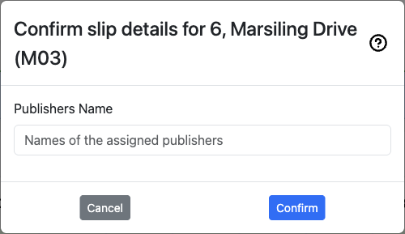

*Figure 19: Map-specific normal assignment creation form*

Click **"Assign"** to create a normal territory assignment. The form displays:

- Territory information in header
- **Publishers Name** field - enter name(s) of assigned publisher(s)
- **Cancel** and **Confirm** buttons

**Personal Slip Assignment:**

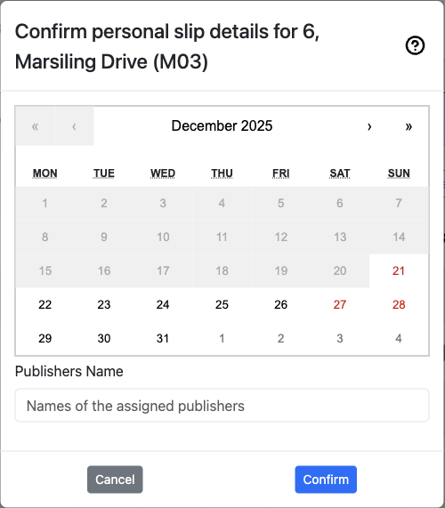

*Figure 20: Map-specific personal slip creation form with calendar*

Click **"Personal"** to create a personal slip assignment. The form includes:

- Territory information in header
- **Calendar picker** - select the assignment date
- **Publishers Name** field - enter name(s) of assigned publisher(s)
- **Cancel** and **Confirm** buttons

**Benefits:**

- ✓ Quick assignment creation while viewing territory
- ✓ No need to switch to assignments modal
- ✓ Immediate context of the territory being assigned

#### Managing Assignments

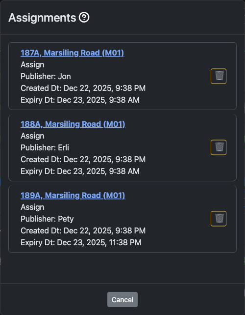

*Figure 21: Assignment management modal showing all active assignments across territories*

The Assignment Management interface allows conductors and administrators to view and manage all existing assignments in the congregation.

**View All Assignments:**

1. Click the **"Assignments"** button from the dashboard
2. The Assignments modal opens displaying all active assignment links
3. View assignments for all territories in a centralized list

**Assignment Information Displayed:**

For each assignment, you can see:

- **Map Name and Location**: The map identifier with its location description (for example, "123A, Sample Street (S01)")
- **Assignment Type**: "Assign" for normal assignments, "Personal" for personal slips
- **Assigned by**: The conductor or administrator who created the link
- **Assigned to**: The publisher the link was issued to (for example, "Sister A. Tan")
- **Created Date/Time**: When the assignment was created (for example, "Aug 21, 2026, 9:38 PM")
- **Expiry Date/Time**: When the link stops working - 24 hours later on the default setting (for example, "Aug 22, 2026, 9:38 PM")
- **Copy Button**: Copy icon to put the link on your clipboard
- **Delete Button**: Trash icon (🗑️) to remove individual assignments

The modal's subtitle keeps a live count of how many links are currently active, for example "3 active links".

**Copy an Assignment Link:**

1. Locate the assignment in the list
2. Click the **Copy link** button next to the delete button
3. A **"Link copied"** confirmation appears and the bare URL is on your clipboard, ready to paste anywhere

Use this when a publisher says they lost the message, or when you would rather paste the link into a conversation you already have open than go through the share sheet. Only the URL is copied - no accompanying message.

**Delete an Assignment:**

1. Locate the assignment in the list
2. Click the **trash icon** (🗑️) button on the right side of the assignment
3. The link is removed straight away - **this is the one action in Ministry Mapper that does not ask you to confirm**, so aim carefully
4. The assignment link immediately becomes inaccessible to the publisher; deleting the last link closes the modal

**When to Delete:**

- Territory returned early by publisher
- Wrong link was created or sent
- Publisher no longer needs access
- Assignment needs to be reassigned to someone else
- Security concern or compromise

**Closing the Assignments Modal:**

- Click the **"Cancel"** button at the bottom to close the modal and return to the dashboard

#### Map-Specific Assignment Management

View and manage assignments for individual territories directly from the map view.

**Access:**

1. Navigate to a territory
2. Click either:
   - **"Assign Links"** - for normal territory assignments
   - **"Personal Links"** - for personal slip assignments

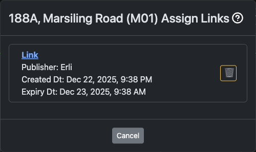

*Figure 22: Assign Links modal for a specific territory*

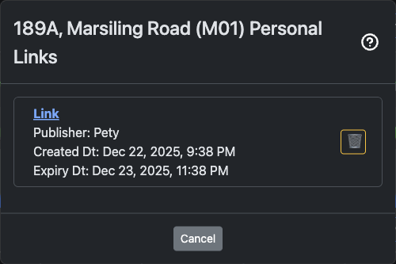

*Figure 23: Personal Links modal for a specific territory*

**Information Displayed:**

- Publisher name
- Created and expiry date/time
- Delete button (🗑️) to remove assignments

**When to Use:**

- Check who currently has a territory assigned
- Remove assignments while viewing the territory
- Manage normal and personal assignments separately

#### Best Practices for Assignments

**Before Creating:**

- ✓ Verify the territory is ready (addresses updated, instructions clear)
- ✓ Check congregation settings for default expiry time
- ✓ Plan appropriate expiry duration for territory size

**When Sharing:**

- ✓ Send the link **directly** to the publisher who needs it
- ✓ Include instructions in your message
- ✓ Remind publisher of expiry time
- ✓ Provide your contact for questions
- ✓ Send during reasonable hours
- ✗ Never post a map link to a public status, story, channel or social media post
- ✗ Never reuse one link for a whole group when each publisher should have their own

**Monitoring:**

- ✓ Regular check for expired assignments
- ✓ Clean up old assignments periodically
- ✓ Follow up if territory not returned
- ✓ Track completion rates

---

### Messages and Instructions

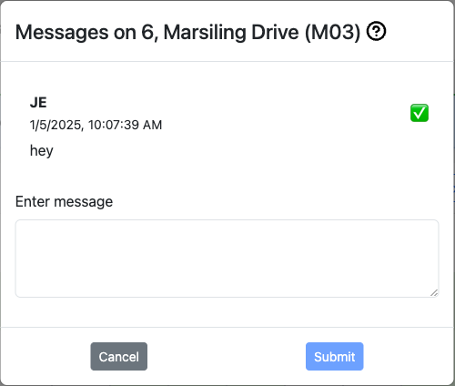

*Figure 24: Messages modal showing posted messages with pinning option*

Administrators and Conductors can post messages visible to specific user groups.

#### Message Types

**Publisher Messages:**

- Visible to all publishers with assignment links
- Instructions for field service
- Territory-specific guidance
- General announcements

**Conductor Messages:**

- Visible to Conductors and Administrators
- Coordination information
- Administrative notes
- Planning information

**Administrator Messages:**

- Visible only to Administrators
- System administration notes
- Critical updates
- Management reminders

#### Posting a Message

1. Click **"Messages"** button
2. Click **"New Message"** or **"+"**
3. Type your message
4. Select message type (Publisher/Conductor/Administrator)
5. Optionally **pin** important messages to top
6. Click **"Post"**

#### Message Features

**Pinning:**

- Pin important messages to keep them at the top
- Only one pinned message per type
- Unpin when no longer critical

**Editing:**

- Edit messages after posting
- Updates immediately for all viewers

**Deleting:**

- Remove outdated messages
- Clean up after events pass

**Reading Status:**

- See who has read messages (administrator view)
- Track acknowledgment of important updates

---

### Real-Time Data Synchronization

Ministry Mapper uses PocketBase real-time subscriptions - delivered over Server-Sent Events - for instant updates:

#### How It Works

**Automatic Synchronization:**

- Changes sync immediately across all connected devices
- No manual refresh needed
- Updates appear instantly for all users viewing same territory

**What Gets Synchronized:**

- ✓ Address status changes
- ✓ New notes and updates
- ✓ Territory progress
- ✓ New messages
- ✓ Assignment changes

**Connection Handling:**

- System automatically detects connection loss
- Reconnects when internet restored
- Shows a connection status indicator - 📵 **"No internet connection"** when you are offline, 📶 **"Weak connection"** when the link is slow
- Publisher address updates made while offline are queued and sent when you are back online (see **Smart Sync** below)

**Performance:**

- Updates only when territory/page is open
- Automatic cleanup when page closed
- Minimal bandwidth usage
- Optimized for mobile data

> **💡 Note**: For real-time updates to work, keep your browser tab active while working on a territory.

#### Smart Sync (Working Through Patchy Coverage)

Field service happens in lift lobbies, stairwells and basement car parks. Smart Sync means a publisher never has to wait for a signal before recording a call.

**What you'll see:**

| Indicator | Where | Meaning |
|-----------|-------|---------|
| **📤 badge with a number** | Top bar of the map page (and the admin navbar and sidebar) | That many of your updates are saved on this device and still waiting to reach the server |
| **Small orange dot** | Top-right corner of an individual address cell | This particular address has an edit that hasn't synced yet |
| **📵 No internet connection** | Bottom-right of the screen | You are offline - keep working anyway |

**How it behaves:**

- Tap **Save** as usual. The status changes on screen straight away, whether or not you have signal.
- Your edit is stored on the device, then sent as soon as a connection is available. Retries back off gradually so hundreds of publishers reconnecting at once don't all hammer the server in the same instant.
- The indicators are deliberately delayed a fraction of a second, so a normal fast save never flickers a badge at you.
- Edit the same address twice offline and the later save wins - only one update per address is ever sent.
- If an edit can never succeed (for example the address was deleted while you were away), it is dropped and you'll see **"1 edit(s) could not be saved and were discarded."**
- If your session expires mid-flush you'll see **"Your session expired. Please sign in again - your offline edits are saved locally."**

!!! warning "What Smart Sync does and does not cover"
    Smart Sync covers **publisher address updates only** - status, not-home count, notes, household types and the location pin. **Administrator and conductor actions still need a live connection**: creating territories or maps, assigning links, changing settings, inviting users, and everything in the Manage and Congregation menus. If you are offline, those buttons will fail rather than queue.

!!! note "Private browsing"
    Safari's Private Browsing blocks the local database Smart Sync uses. Ministry Mapper detects this and writes straight to the server instead - everything still works, but there is no offline queue in that mode.

---

### User Management (Administrators Only)

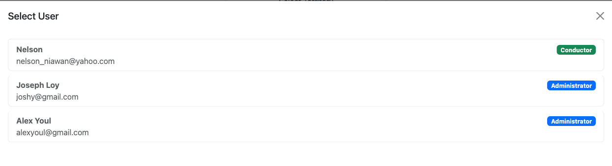

*Figure 25: User management panel showing user list with roles*

Administrators have full control over user accounts and permissions within their congregation.

#### Viewing Users

1. Click your **profile icon** or **user menu**
2. Select **"User Management"** or **"Users"**
3. View complete list of congregation users showing:
   - User name
   - Email address
   - Verification status (✓ verified / ✗ not verified)
   - Current role badge
   - Last activity

#### Inviting New Users

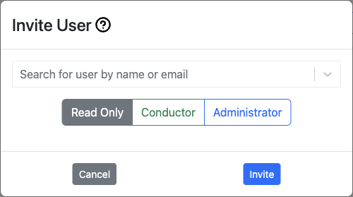

*Figure 26: User invitation dialog for adding new congregation members*

**Step 1: Open Invite Dialog**

1. In User Management, click **"Invite User"** or **"+"**
2. Invite user modal opens

**Step 2: Enter User Information**

- **Email Address**: Start typing to search for an existing Ministry Mapper account
- **Access Level**: Pick one of the three congregation roles:
  - **Read-only**
  - **Conductor**
  - **Admin**

!!! note "There is no Publisher option here"
    Publishers do not need accounts and are never invited. They receive a map link instead. The invite dialog therefore offers only the three real congregation roles. Ministry Mapper also stops you inviting yourself, and warns **"This user is already part of the congregation."** if the person already has a role.

**Step 3: Send Invitation**

1. Click **"Send Invite"**
2. System sends invitation email to user
3. Email contains:
   - Link to create account
   - Congregation information
   - Role assignment details
   - Instructions for getting started

**Step 4: User Completes Registration**

- User receives email
- Clicks link to sign up
- Creates account with password
- Verifies email address
- Automatically added to congregation with assigned role

#### Changing User Roles

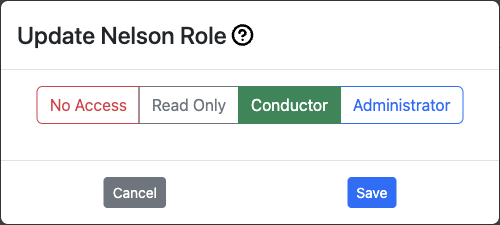

*Figure 27: User details and role management interface*

1. Locate user in the user list
2. Click on the user or **"Edit"** button
3. Pick the new **Access Level** from the row of buttons:
   - **No Access**: Removes the person from the congregation (see below)
   - **Read-only**: View-only dashboard access
   - **Conductor**: Can create assignments, add and update addresses, reset and delete territories, and post messages
   - **Admin**: Full control
4. Click **"Save"**
5. Changes take effect immediately

> **⚠️ Important**: Users must log out and log back in to see their new permissions reflected.

#### Removing User Access

1. Open the user from the user list
2. Set their **Access Level** to **"No Access"** and click **"Save"**
3. Their role in your congregation is deleted. Their Ministry Mapper account still exists, but they can no longer see any of your congregation's data - they will land on **"Access Denied 🔐"** if they sign in
4. You can invite them again later; they keep the same account

!!! note "No Access is not a role"
    Ministry Mapper stores exactly three roles - Read-only, Conductor and Administrator. Choosing **No Access** does not assign a fourth, weaker role; it deletes the person's role record for your congregation. There is nothing left to audit against them afterwards apart from the role-change log.

#### User Verification Status

**Verified Users (✓):**

- Email address confirmed
- Full access to assigned permissions
- Can log in normally

**Unverified Users (✗):**

- Email not yet confirmed
- Limited or no access
- Need to check email and click verification link

**To Resend Verification:**

- Some systems allow resending verification email
- Or ask user to use "Forgot Password" feature

---

### Congregation Settings (Administrators Only)

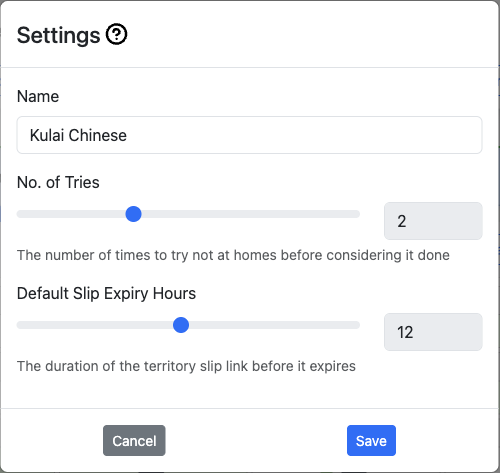

*Figure 28: Congregation settings page with all configuration options*

Configure how Ministry Mapper works for your congregation.

#### Accessing Settings

1. Open the left-hand panel with the button in the top-left corner
2. Expand the **Congregation** group
3. Choose **Settings**

#### Key Settings

The **Congregation Settings** dialog holds three fields. Nothing is saved until you click **"Save"**.

**1. Name**

- Your congregation's display name, shown in the top bar and in the congregation picker

**2. No. of Tries** (Maximum "Not Home" attempts)

- Set with a slider; the current interface allows **1 to 4**
- Described in the dialog as *"The number of times to try not at homes before considering it done"*
- Once an address reaches this many "Not Home" attempts it counts as complete for progress purposes, even though its status is still Not Home
- This is a **per-congregation** value - there is no single global default. If it has never been set, publisher map links fall back to **1**; the sample data that ships with a new deployment uses **3**

**Example:** If set to 3:

- First "Not Home": Count = 1
- Second "Not Home": Count = 2
- Third "Not Home": Count = 3, marks complete

**3. Default Slip Expiry Hours** (Assignment link expiry)

- Set with a slider; the current interface allows **1 to 24** hours
- Default: **24 hours**
- Described in the dialog as *"The duration of the territory slip link before it expires"*
- Applies to newly created links; links already issued keep the expiry they were created with
- Shortening this is the single most effective way to limit the damage a leaked map link can do

#### Other Congregation Properties

These belong to your congregation but are **not** editable from the Congregation Settings dialog - they are set up when your deployment is prepared, and your administrator needs to ask whoever runs the server to change them.

| Property | What it does | Notes |
|----------|--------------|-------|
| **Origin / country** | Sets the default map centre and the formatting used when directions are handed to an external app | One of 13 supported countries |
| **Timezone** | The timezone used for scheduled emails and reports | One of 20 IANA zones (for example `Asia/Singapore`) |
| **Household options** | The household type list offered on every address | Editable in-app - see **Congregation Options** below |

#### Sign-In Security (OTP and MFA)

One-time passwords are a **deployment-wide** setting, not a per-congregation toggle, so you will not find a switch for it in Congregation Settings.

- When enabled, signing in with email and password is followed by a **4-digit code** emailed to you, valid for **180 seconds**
- Ministry Mapper's second factor is **email OTP only** - there is no authenticator-app code and there are no backup codes
- Whether it is on depends on how your deployment was configured. If you are unsure, try signing in: if no code screen appears, OTP is off for your server
- Google sign-in does not use OTP - Google handles the second factor itself

#### Congregation Options (Household Types)

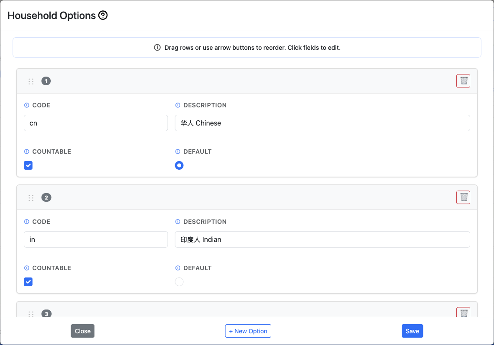

*Figure 29: Congregation options management showing household type configuration*

Configure custom household classification types for your territory.

**What Are Congregation Options?**

- Custom categories for classifying households
- Examples: Language groups (Chinese, English, Tamil)
- Can represent any classification system your congregation uses
- Multiple types can be assigned to single household if configured

**Managing Options:**

1. **View Options**

   - In Settings, find "Congregation Options" section
   - See list of all configured types

2. **Add New Option**

   - Click "Add Option" or "+"
   - Fill in:
     - **Code**: Short identifier (e.g., "CHI", "ENG")
     - **Description**: Full name (e.g., "Chinese", "English")
     - **Is Countable**: Check if should count toward territory progress
     - **Is Default**: Check if should be default selection
     - **Sequence**: Display order number
   - Click "Save"

3. **Edit Option**

   - Click on existing option
   - Modify fields
   - Save changes

4. **Delete Option**
   - Click delete button for option
   - Confirm deletion
   - **Warning**: Affects all addresses using this type

**Option Flags:**

**Is Countable:**
- Controls whether addresses with this type count toward territory progress
- **Checked**: Included in progress calculation (e.g., Chinese, English, Tamil)
- **Unchecked**: Excluded from progress (e.g., Business, Under Construction)
- Example: 100 total addresses, 10 marked "Business" (not countable) = progress based on 90 addresses only

**Is Default:**
- Auto-selects this type when creating new addresses
- Only one option should be default
- Use for your most common household type

**Sequence:**
- Controls display order in dropdown menus
- Lower numbers appear first (1, 2, 3...)
- **Managed by drag and drop** in settings - simply drag options to reorder
- Affects order in address household dropdowns
- Tip: Order from most common to least common

**Multiple Selection Configuration:**

- Enable if households can have multiple types
- Example: Household speaks both Chinese and English
- When disabled, only one type per household

#### Map Configuration

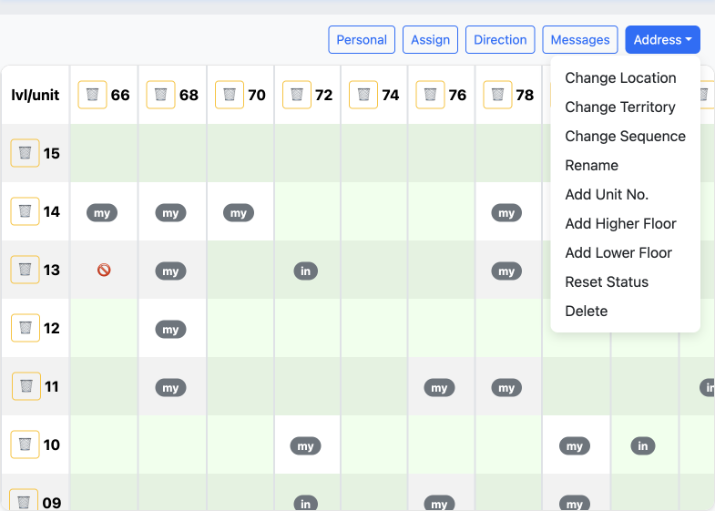

*Figure 30: Advanced map configuration options for administrators*

Configure how maps are displayed and behave in your congregation. Administrators have access to powerful map management functions for territory maintenance and organization.

**To Access Map Configuration:**

1. Go to **Settings** (Administrators only)
2. Select a territory from the dropdown
3. Open the map view for the selected territory
4. Access the map configuration menu (typically via a settings icon or menu)

**Available Map Configuration Functions:**

**1. Change Location**
   - Relocate a map marker to a different address
   - Updates the geographical location of a territory unit
   - Useful when addresses have changed or initial location was incorrect
   - Simply select the new location on the map

**2. Change Territory**
   - Move an address or unit to a different territory
   - Helps reorganize territory boundaries
   - Useful for balancing territory sizes
   - Maintains all address data and history during transfer

**3. Change Sequence**
   - Modify the visit order number for an address
   - Optimizes the route for field service efficiency
   - Lower numbers are visited first
   - Helps create logical visiting patterns

##### Update Map Sequence (Drag & Drop)

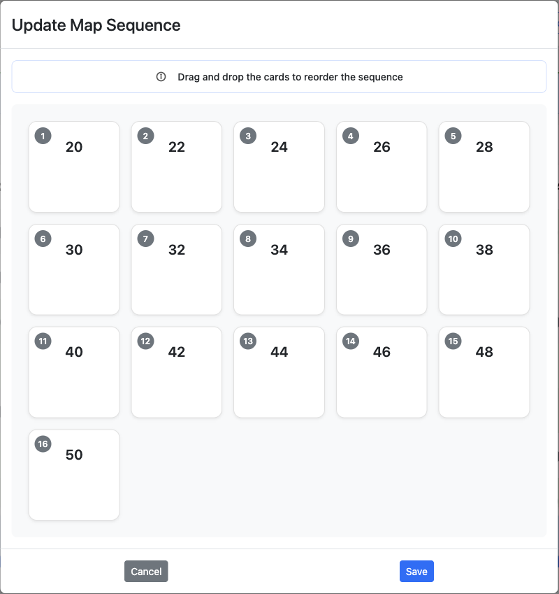

*Figure 31: Drag and drop interface for reordering all map sequences in a territory*

**Access:** Address menu → "Change Sequence"

**How It Works:**
1. Each card shows an address with current sequence number
2. Drag and drop to reorder - numbers update automatically
3. Click **"Save"** to apply or **"Cancel"** to discard

**Best Practices:**
- Minimize backtracking by grouping nearby addresses
- Group floors together in multi-story buildings
- Create logical flow from one end to the other
- Review map view after sequencing

**4. Rename**
   - Change the name or identifier of an address/unit
   - Update building names or unit numbers
   - Keeps data current with real-world changes
   - Useful for correcting initial entry errors

**5. Add Unit No.**
   - Add new unit numbers to existing addresses
   - Expand multi-story buildings with additional units
   - Useful when new apartments are added to a building
   - Maintains building structure organization

**6. Add Higher Floor**
   - Extend a building upward with additional floors
   - For buildings that have been expanded or initially underestimated
   - Automatically creates units for new floors based on building pattern
   - Helps keep territory data current with construction changes

**7. Add Lower Floor**
   - Add floors below the current lowest floor
   - Useful for basement levels or newly accessible lower floors
   - Can add negative floor numbers (e.g., B1, B2)
   - Maintains consistent floor numbering system

**8. Reset Status**
   - Clear the status of an address back to "Not Done"
   - Removes "Done" and "Not Home" statuses only
   - Does NOT remove "Do Not Call" or "Invalid" statuses
   - Preserves notes and other address information
   - Useful when restarting work on a previously completed address
   - Does not affect other addresses in the territory

**9. Delete**
   - Permanently remove an address, unit, or floor from the territory
   - Cannot be undone - use with caution
   - Helpful for removing duplicate entries or non-existent addresses
   - Confirm carefully before deleting

**Common Use Cases:**
- Correcting errors: Rename and Change Location
- Territory rebalancing: Change Territory
- Building updates: Add Higher/Lower Floor
- Route optimization: Change Sequence
- Data cleanup: Delete duplicates
- Seasonal updates: Reset Status

> **⚠️ Warning**: Changes affect all users immediately. Delete is permanent and cannot be undone.

---

### Territory Management (Administrators Only)

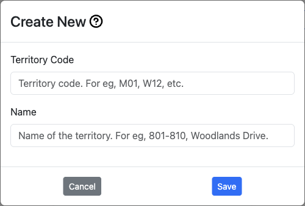

*Figure 32: Territory creation interface for adding new territories*

Administrators have full control over creating, editing, and managing territories.

#### Creating a New Territory

**Step 1: Access Territory Creation**

1. Click the **territory selector** dropdown
2. Select **"Create New Territory"** or **"New Territory"**
3. Territory creation form opens

**Step 2: Enter Territory Information**

- **Territory Code**: Short identifier (e.g., "T-001", "M-12", "W-05")
  - Keep it short and meaningful
  - Use consistent naming convention
  - Maximum recommended: 10 characters
- **Description**: Full name or area description
  - Examples: "Downtown Commercial", "Northside Residential"
  - Be descriptive for easy identification
  - Maximum recommended: 100 characters

**Step 3: Create**

1. Click **"Create Territory"**
2. New territory is created and selected
3. Ready to add addresses

#### Editing Territory Details

**Change Territory Code:**

1. Select the territory
2. Click ✏️ **"Edit"** or **"Change Territory Code"**
3. Enter new code
4. Save changes
5. **Warning**: Update any references to old code

**Change Territory Description:**

1. Select territory
2. Click **"Change Territory Name"** or edit option
3. Update description
4. Save changes

**Change Territory Sequence:**

##### Update Territory Sequence (Drag & Drop)

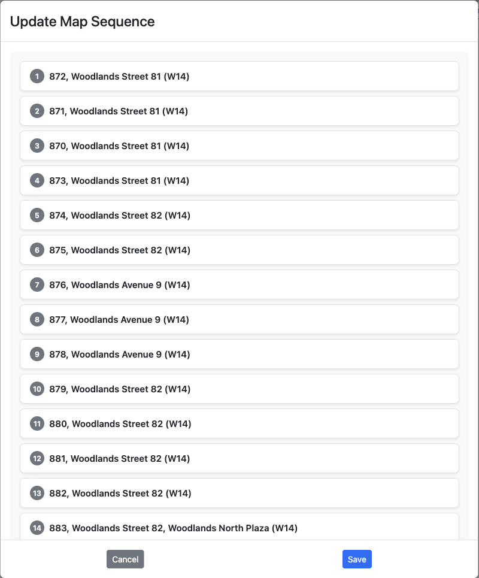

*Figure 33: Drag and drop interface for reordering all territories in the congregation*

**Access:** Territory dropdown → "Change Sequence"

**How It Works:**
1. Each card shows territory code and description
2. Drag and drop to reorder - sequence numbers update automatically
3. Click **"Save"** to apply or **"Cancel"** to discard
4. Controls order in selection dropdowns and lists

**Best Practices:**
- Organize by geographical proximity
- Group by type (residential, commercial, business)
- Consider field service group assignments
- Use for territory rotation planning

#### Territory Configuration Options

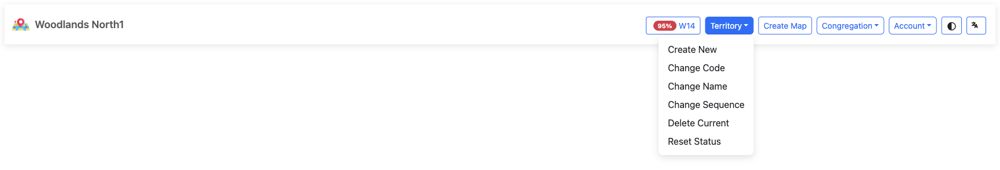

*Figure 34: Territory dropdown menu showing configuration options*

Administrators can access territory configuration options through the **Territory dropdown** button in the top navigation bar. Click the button to reveal the following options:

**Available Options:**

- **Create New**: Create a new territory from scratch
- **Change Code**: Modify the territory's unique identifier
- **Change Name**: Update the territory description
- **Change Sequence**: Reorder how territories appear in the selection list
- **Delete Current**: Permanently remove the currently selected territory
- **Reset Status**: Clear all address statuses back to "Not Done"

These options provide quick access to common territory management tasks without navigating through multiple menus.

#### Territory Operations

Both operations below live in the **Territory** dropdown shown in the previous screenshot - **Reset Status** and **Delete Current**.

!!! note "Conductors too, not only administrators"
    Resetting and deleting a territory are the two territory-level operations that **conductors** are also permitted to perform. The menu that holds them is currently shown only to administrators, so a conductor who needs one of these done should ask an administrator to run it.

**Reset Territory:**

Resets all addresses in territory to "Not Done" status:

1. Select territory
2. Click **"Reset Territory"** button
3. Confirm action (this clears all visit data!)
4. All addresses return to "Not Done"
5. Not home counts reset to 0
6. Notes are preserved
7. Progress resets to 0%

**Use When:**

- Territory fully worked and ready to reassign
- Starting new round of visits
- Cleaning up test data

**⚠️ Warning**: Cannot be undone. All status updates will be lost.

**Delete Territory:**

Permanently removes territory and all its data:

1. Select territory to delete
2. Click **"Delete Territory"** button
3. Read warning message carefully
4. Type confirmation if required
5. Confirm deletion

**Deletes:**

- Territory record
- All addresses in territory
- All units and floors
- All assignment history
- All related data

**⚠️ Critical Warning**: This action CANNOT be undone. Consider exporting data first.

---

### Address Management (Administrators Only)

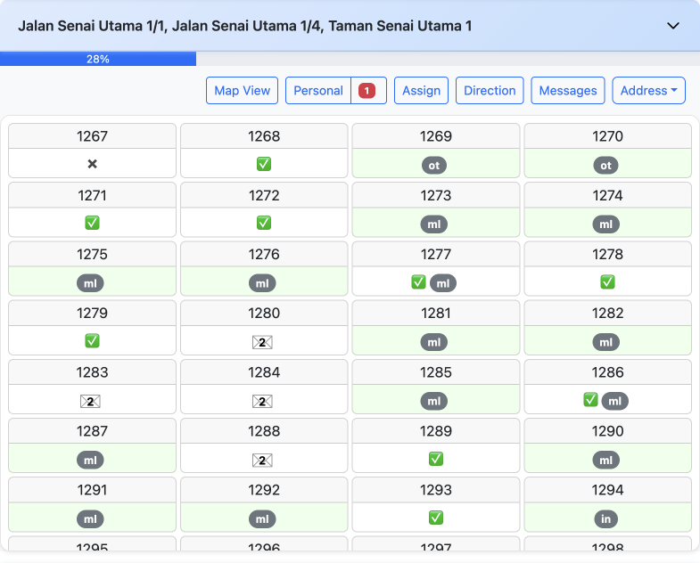

*Figure 35: Address management interface for private/single-story properties*

Administrators can add and manage addresses within territories.

#### Address Types

Ministry Mapper supports two types of addresses:

**1. Public Addresses (Multi-Story)**

- Apartment buildings, condominiums
- Multiple floors and units
- Examples: HDB flats, apartment complexes
- Each floor has multiple units

**2. Private Addresses (Single-Story)**

- Individual houses, shophouses
- Single properties with one address
- Examples: Landed properties, standalone buildings
- No floor/unit structure

#### Adding a Public Address (Multi-Story)

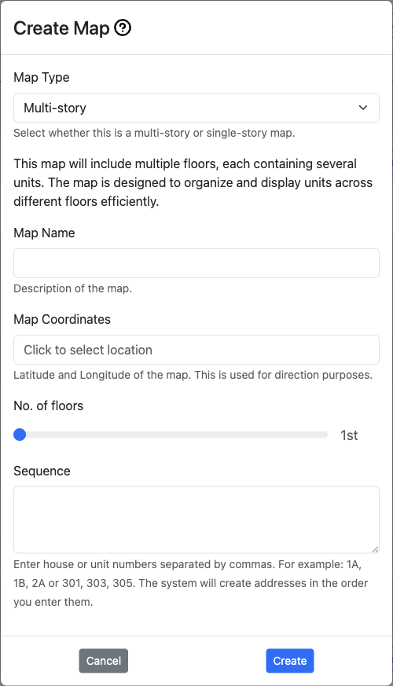

*Figure 36: The Create Map dialog, where the map type, name, coordinates, floors and unit numbers are entered*

**Step 1: Initiate Creation**

1. Select territory
2. Click **"New Map"** in the territory header
3. Set **Map Type** to **Multi-story**

**Step 2: Enter Building Information**

- **Postal Code/Address**: Building identifier
  - Enter postal code or street address
  - System may auto-populate location
  - Used for geocoding and map display
- **Building Name**: Optional building name
  - Examples: "Block 123A", "Sunny Heights"
  - Helps publishers identify building

**Step 3: Configure Floors**

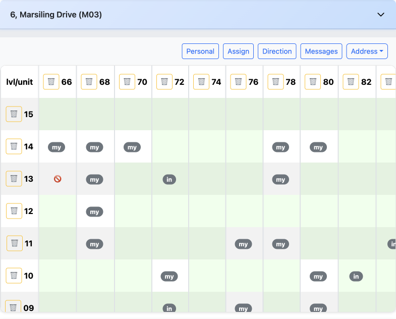

*Figure 37: Multi-story building management with floor and unit organization*

- **Start Floor**: Lowest floor number
  - Can be negative for basement levels
  - Examples: -2 (B2), 1 (Ground), 0
- **Top Floor**: Highest floor number
  - Maximum: 50
  - Examples: 10, 25, 40
- **Floor Selection**: Choose specific floors
  - Skip floors with no units (e.g., mechanical floors)
  - Typical: All floors from start to top

**Step 4: Configure Units**

- **Units Per Floor**: Number of units on each floor
  - Examples: 8, 12, 16
  - Creates units automatically
- **Unit Number Format**: How to number units
  - Pattern: Floor + unit (e.g., 01-01, 01-02)
  - Custom: Manually enter unit numbers later

**Step 5: Create and Populate**

1. Click **"Create"**
2. System generates all floors and units
3. Address appears in territory with all units

**Example:**

- Building: Block 123
- Floors: 1 to 12
- Units per floor: 8
- Result: 96 units created (12 floors × 8 units)

#### Adding a Private Address (Single-Story)

**Step 1: Initiate Creation**

1. Select territory
2. Click **"Add Address"** or **"+"**
3. Select **"Private Address"** type

**Step 2: Enter Property Information**

- **Property Postal/Address**: Unique identifier
  - Street address or postal code
  - Each property is one record
- **Property Name**: Optional house name
  - Examples: "123 Main Street", "Villa Sunshine"

**Step 3: Set Location**

- Tap **Use my location** if you are at the property, or **On map** to place the pin by hand
- Until a pin is set the field reads **"No pin set"**, and the address will not appear in Map View
- Can be updated later - see **Saving a House's Location**

**Step 4: Create**

1. Click **"Create Property"**
2. Single address unit created
3. Appears in territory list

#### Managing Existing Addresses

**Edit Address Name:**

1. Select territory with address
2. Click edit option for address
3. Update name/postal
4. Save changes

**Change Postal Code:**

1. Access address edit mode
2. Update postal code field
3. May affect geocoding
4. Save and verify map location

**Reset Address:**

- Clears all unit statuses in address
- Notes preserved
- Use when address fully worked

**Delete Address:**

- Removes entire address and all units
- Cannot be undone
- Confirm carefully before deleting

#### Managing Units (Public Addresses Only)

**Add Units:**

1. Select address
2. Click **"Add Units"**
3. Specify unit numbers to add
4. Units created automatically

**Delete Units:**

1. Click on specific unit
2. Click **"Delete Unit"** button in modal
3. Confirm deletion
4. Unit removed from address

**Change Unit Sequence:**

1. Open unit edit modal
2. Update sequence number
3. Affects visit order
4. Lower numbers visited first

**Add/Delete Floors:**

1. Access floor management
2. Add new floor numbers
3. Or remove entire floors
4. All units on floor affected

**Update Unit Geolocation:**

- Set specific coordinates for unit
- Useful for large buildings
- Helps with precise navigation
- Optional feature

---

## Mobile Usage

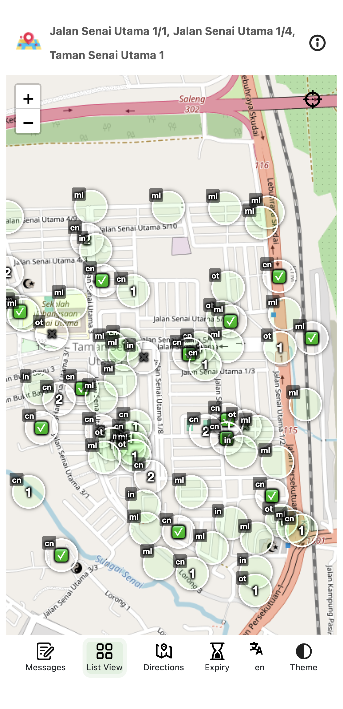

*Figure 38: Mobile-responsive interface optimized for field service*

### Using Ministry Mapper on Your Phone

Ministry Mapper is fully responsive and optimized for mobile devices, making it perfect for field service.

#### Accessing on Mobile

**Browser Access:**

1. Open your mobile browser:
   - **iOS**: Safari, Chrome
   - **Android**: Chrome, Firefox, Samsung Internet
2. Navigate to your congregation's Ministry Mapper URL
3. Log in or click assignment link
4. Interface automatically adapts to your screen size

**Features on Mobile:**

- ✓ Touch-friendly buttons and controls
- ✓ Swipe gestures for navigation
- ✓ Optimized layouts for small screens
- ✓ Larger tap targets for easy selection
- ✓ Full access to all desktop features
- ✓ Interactive map integration with GPS

#### Progressive Web App (PWA) Installation

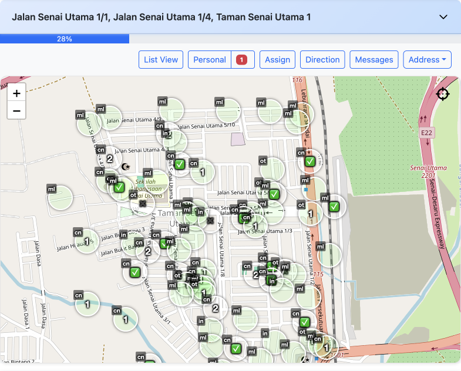

*Figure 39: Full-screen map view mode available in PWA installation*

Ministry Mapper can be installed on your phone's home screen so it opens like an ordinary app.

**Benefits of Installing:**

- 🚀 Faster loading with cached resources
- 📱 App icon on home screen
- 🎯 Full-screen experience (no browser UI)
- ⚡ Improved performance
- 🔔 Better integration with device

**iOS Installation (Safari):**

1. Open Ministry Mapper in Safari
2. Tap the **Share** button (📤)
3. Scroll down and tap **"Add to Home Screen"**
4. Edit name if desired
5. Tap **"Add"**
6. App icon appears on home screen

**Android Installation (Chrome):**

1. Open Ministry Mapper in Chrome
2. Tap the menu button (⋮)
3. Select **"Install app"** or **"Add to Home Screen"**
4. Confirm installation
5. App icon appears on home screen or app drawer

**Using the Installed App:**

- Launch from home screen like any app
- No browser address bar
- Seamless app experience
- Google sign-in works normally in the installed app

**Keeping the Installed App Up to Date**

An installed copy caches itself, so it needs to be told when a newer version exists. Ministry Mapper checks in several ways - when a new version takes over, when you switch back to the tab or app, and when you resume it from your phone's app switcher.

When an update is found you'll see a message that stays on screen until you deal with it:

> **Update Available**
> Reload to get the latest updates.

Tap **Reload**. It takes a second or two and you lose nothing - any queued offline edits are stored on the device, not in the page.

!!! tip "The browser is still the recommended way in"
    Installing is convenient, but opening Ministry Mapper in your normal mobile browser is the simplest way to be certain you are on the current version. If you ever see behaviour that does not match this guide, open the site in your browser and check again there.

#### Mobile Best Practices

**Before Going Out:**

1. ✓ Check assignment link hasn't expired
2. ✓ Review territory and map
3. ✓ Note any special instructions
4. ✓ Ensure stable internet connection
5. ✓ Fully charge your device
6. ✓ Consider portable charger

**While in Field Service:**

1. ✓ Update addresses immediately after visits
2. ✓ Add notes while information is fresh
3. ✓ Use GPS navigation on map
4. ✓ Follow sequence numbers for efficient routing
5. ✓ Save battery by dimming screen when not needed

**Data Usage Tips:**

- Ministry Mapper uses minimal data
- Map tiles may use more data
- Most updates are < 1KB each
- Suitable for mobile data usage

### Offline Capabilities and Limitations

Ministry Mapper is **not** an offline-only app, but it is not helpless without a signal either. The honest summary is: **a publisher can keep recording calls; an administrator cannot keep administering.**

**What works offline:**

- ✓ A territory map you have already opened keeps displaying, from a copy stored on the device
- ✓ Updating an address - status, not-home count, notes, household types and the location pin - is saved on the device and sent when the connection returns (see **Smart Sync**)
- ✓ Your own queued edits are shown back to you, so the grid reflects what you have recorded
- ✓ "Use my location" for pinning a house, since the position comes from the device itself
- ✓ The app shell itself - Ministry Mapper opens rather than showing a browser error page

**What does not work offline:**

- ✗ Opening a map for the first time, or a map whose cached copy has expired
- ✗ Real-time updates from other publishers - you will not see their changes until you reconnect
- ✗ Fresh map tiles for areas you have not already looked at
- ✗ Signing in, and anything that needs a fresh session
- ✗ **All administrator and conductor actions** - creating territories or maps, assigning links, changing settings, inviting users, generating reports
- ✗ The offline queue itself, if you are in Safari's Private Browsing (updates go straight to the server instead, so they simply fail while offline)

**Handling Connection Loss:**

- A 📵 **"No internet connection"** pill appears at the bottom-right; a slow link shows 📶 **"Weak connection"**
- The publisher map's bottom navigation dims while you are offline, because those actions need the network
- The 📤 badge counts how many of your updates are still waiting to be sent
- Everything sends itself when the connection returns - there is no "sync now" button to hunt for

**Recommendations:**

- ✓ Open the territory once while you still have signal, so it is cached before you go inside
- ✓ Keep working normally in a lift lobby or basement - do not wait for bars before saving
- ✓ Before you finish for the day, check the 📤 badge has cleared
- ✓ Administrators: do your setup work somewhere with a connection
- ✓ Consider a portable WiFi hotspot for areas with no coverage at all

---

## Account Settings and Profile

### Personal Profile Management


*Figure 40: Login interface for accessing your Ministry Mapper account*

**Accessing Your Profile:**

1. Click your **profile name/icon** (top right corner)
2. Select **"Profile"** from dropdown menu
3. View and manage your account settings

**Available Profile Options:**

- View account information (name, email)
- Change password
- View congregation membership
- Access user management (Administrators only)
- Log out

### Changing Your Password

**Security Requirements:**

As you type, a live checklist shows four items:

- **Minimum 6 characters** - the only rule the server actually enforces
- **At least one number** - guidance to help you choose a stronger password
- **At least one capital letter** - guidance to help you choose a stronger password
- **Passwords match** - both fields must be identical

**Steps to Change:**

1. Go to your profile
2. Click **"Change Password"**
3. Enter your **current password**
4. Enter **new password**
5. **Confirm new password**
6. Click **"Save"** or **"Change Password"**
7. Success message confirms change

> **💡 Tip**: Use a strong, unique password. Consider using a password manager.

### Password Recovery

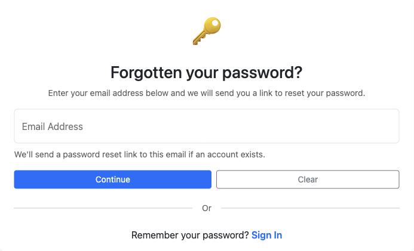

*Figure 41: Password recovery page for resetting forgotten passwords*

Forgot your password? Easy recovery process:

1. Go to login page
2. Click **"Forgotten your password?"** link
3. Enter your **registered email address**
4. Click **"Continue"** or **"Send Reset Link"**
5. Check your email inbox

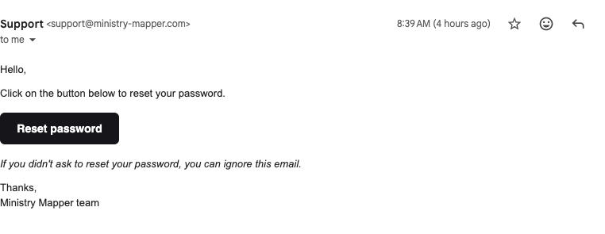

*Figure 42: Password reset email with secure link to create new password*

6. Click the password reset link - it is valid for **30 minutes**, so use it promptly
7. Create a new password meeting requirements
8. Confirm new password
9. Log in with new password

**If you don't receive the email:**

- Check spam/junk folder
- Verify you entered correct email
- Wait a few minutes and try again
- Contact administrator if issues persist

### Language Selection

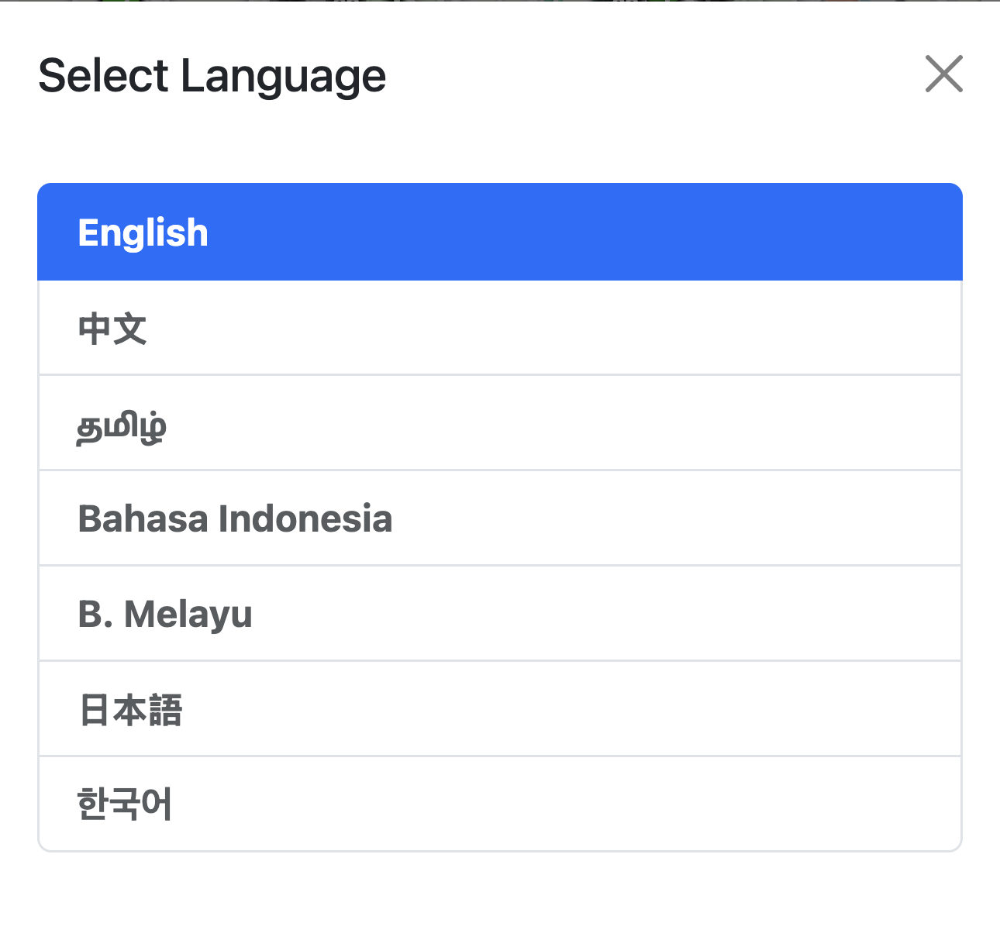

*Figure 43: Language selection interface showing all supported languages*

Ministry Mapper is available in **eight languages**, and you choose yours inside the app - there is nothing to configure in your browser or operating system.

**Supported Languages:**

| Language | Shown in the picker as |
|----------|------------------------|
| English | English |
| Spanish | Español |
| Chinese | 中文 |
| Tamil | தமிழ் |
| Indonesian | Bahasa Indonesia |
| Malay | B. Melayu |
| Japanese | 日本語 |
| Korean | 한국어 |

**To Change Language:**

There is a **Language** button in three places, so you are never far from it:

| Where | Who uses it |
|-------|-------------|
| Footer of the left-hand panel | Administrators, conductors and read-only users |
| Footer of the sign-in screen | Anyone, **before** signing in |
| Bottom navigation of the publisher map page | Publishers working from a map link |

1. Tap **Language**
2. The **"Select Language"** dialog lists all eight languages, with a tick beside the one in use
3. Tap the language you want

The interface changes immediately - there is nothing to save and no need to refresh. Your choice is remembered on that device, so it is still there next time.

**How Language is Determined the First Time:**

- If you have chosen a language before, that choice wins
- Otherwise Ministry Mapper starts from your browser's language
- If that language is not one of the eight, it falls back to English

!!! note "Territory and map descriptions"
    Text your congregation typed in - map names, territory descriptions - can be stored per language. Where a translation for your language exists you will see it; where it does not, you will see the English version, or the original text as it was entered.

### Appearance and Theme Settings

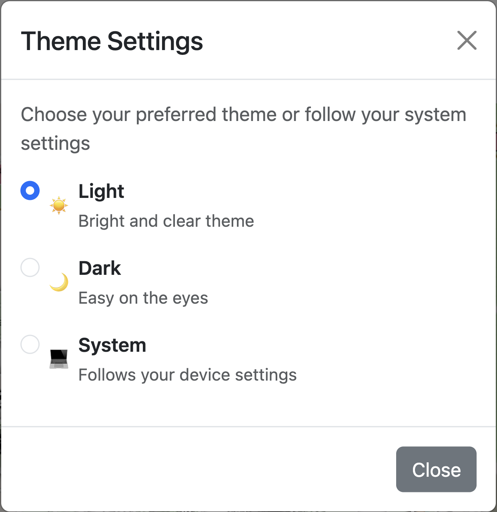

*Figure 44: Theme Settings, with the light/dark/system rows above the five colour choices*

Ministry Mapper lets you set both **how bright** the interface is and **which colour** it uses.

**Opening Theme Settings:**

Tap the **palette icon** - in the footer of the left-hand panel for administrators and conductors, in the footer of the sign-in screen, or in the bottom navigation of the publisher map page. The dialog is titled **"Theme Settings"**: *"Choose your preferred theme or follow your system settings."*

**Light, Dark or System:**

| Option | Description shown in the app |
|--------|------------------------------|
| ☀️ **Light** | Bright and clear theme |
| 🌙 **Dark** | Easy on the eyes |
| 💻 **System** | Follows your device settings |

**System** is the starting point, and it keeps following your phone or computer - so if your device switches to dark in the evening, Ministry Mapper does too.

**Colour:**

Below that, a **Color** row offers five colour swatches:

| Theme | Character |
|-------|-----------|
| **Classic** | The neutral default - black and white with no colour cast |
| **Tangerine** | Warm orange-red |
| **Perpetuity** | Teal |
| **Cosmic Night** | Violet |
| **Mocha Mousse** | Muted brown |

**Things worth knowing:**

- There is **no Save button** - tap a row or swatch and the whole interface changes instantly
- Your choice is stored **per device**, not on your account, so your phone and your laptop can differ
- **Status symbols never change colour with the theme.** Done stays green, Do Not Call stays red, Invalid stays violet, and the not-home envelope stays orange, in every theme and in both light and dark. That is deliberate - a status must never become ambiguous because someone picked a different colour scheme

### What's New (Release Notes)

Ministry Mapper tells you what changed rather than leaving you to discover it.

**The pop-up:**

- A dialog titled **"What's New"** appears the first time you open Ministry Mapper after an update
- Each entry is dated, the newest carries a **"Latest"** badge, and individual items are tagged **New**, **Fix**, **Improved** or **Announcement**
- Some releases carry a highlighted notice or a screenshot
- Read it and close it - it will not come back for the same release

**Finding it again:**

- Administrators, conductors and read-only users: **Release History** (labelled **Updates**) in the footer of the left-hand panel
- That view shows the last ten releases, not only the ones you have not seen

!!! note "You and your publishers may see different items"
    Some items only matter to the people who administer territories, and some only matter to publishers working from a map link. Ministry Mapper works out which you are from the page you are on and shows the relevant items - so an administrator and a publisher can legitimately see different lists for the same release. Announcements and screenshots are always shown to everyone. Each audience's "already seen" state is tracked separately, so reading the administrator list does not hide the publisher list from a publisher using the same device.

---

## Best Practices

### For Publishers {#best-practices-for-publishers}

| Phase | Best Practices |
|-------|---------------|
| **Before Starting** | Review territory on map • Check notes/instructions • Plan route using sequences • Note "Do Not Call" addresses • Ensure device charged |
| **During Service** | Update immediately after each visit • Add detailed, respectful notes • Follow sequence numbers • Use map for navigation • Mark "Not Home" accurately • Tap **Use my location** to pin landed houses as you reach them |
| **After Completing** | Review all updates • Use the **"X to go"** button to sweep up the last few addresses • Check the 📤 badge has cleared before you finish • Add final observations • Notify administrator if complete • Report address issues |

### For Conductors

- Set appropriate link expiry times based on territory size - shorter is safer
- Include publisher names for tracking, and check the **"Already assigned"** warning before issuing another link for the same map
- Send links directly to the publisher; never post one publicly
- Clean up expired assignments regularly - remember the delete button asks for no confirmation
- Sort the map list by **Progress** to see what still needs attention, or by **Proximity** when you are out in the territory
- Monitor territory completion and follow up on overdue assignments
- Post clear messages and instructions

### For Administrators

| Area | Best Practices |
|------|---------------|
| **Territory Setup** | Consistent naming • Short, meaningful codes • Clear descriptions • Verify map locations • Logical sequences |
| **Data Management** | Regular cleanup • Reset completed territories • Verify accuracy • External backups • Train users |
| **User Management** | Appropriate role assignment • Remove inactive users • Prompt response to requests • Clear communication |

### General Principles

- **Plan Ahead**: Review before going out
- **Work Systematically**: Complete one section at a time
- **Update Promptly**: Don't wait to record information
- **Communicate Clearly**: Write understandable, respectful notes
- **Be Thorough**: Cover all addresses persistently
- **Stay Flexible**: Adapt to territory needs

---

## Troubleshooting Common Issues

### Login Problems

| Issue | Symptoms | Solutions |
|-------|----------|-----------|
| **Incorrect Password** | "Invalid credentials" error | Verify email • Check Caps Lock • Use "Forgot Password" → Reset via email |
| **Account Not Verified** | "Email not verified" message | Check inbox/spam for verification email • Click link • Request new if expired |
| **No Congregation Access** | Logged in but no territories shown | Contact administrator to invite you and assign role • Log out/in after access granted |
| **OTP Issues** | Not receiving/invalid OTP code | Check spam • The 4-digit code expires after 180 seconds (3 minutes) • Tap **Resend OTP** for a fresh one • Verify email address |

---

### Data Update Problems

| Issue | Symptoms | Solutions |
|-------|----------|-----------|
| **Changes Not Saving** | Save doesn't persist, disappears after refresh | Check internet connection • Refresh page (Ctrl/Cmd + R) • Clear browser cache • Try different browser • Check for concurrent editing |
| **Real-Time Updates Not Appearing** | Changes by others not showing | Ensure active internet • Keep page open • Refresh to force update • Check connection status |
| **📤 Badge Won't Clear** | Count of pending updates stays put | You are offline or on a very weak connection - the queue sends itself when the connection returns • Keep the page open • Check the connection pill at the bottom-right • If the count drops with a "could not be saved" warning, those addresses changed on the server and need re-entering |
| **Household Type Won't Save** | "Please select at least one household type." | Pick at least one type in the household picker, then tap **Done** (not Cancel) - Ministry Mapper cannot count an address that has no type |
| **Admin Action Fails Offline** | Assign, settings or territory action errors out | Administrator and conductor actions need a live connection - Smart Sync only queues publisher address updates • Reconnect and try again |

---

### Map and Navigation Issues

| Issue | Symptoms | Solutions |
|-------|----------|-----------|
| **Map Not Loading** | Gray box, error, frozen map | Refresh page (F5) • Wait 10-15 seconds • Check internet speed • Clear cache • Try different browser • Enable JavaScript |
| **Incorrect Location** | Markers misplaced | Open the address and re-set the pin with **Use my location** while standing there, or **On map** • Verify postal code |
| **Address Missing From Map View** | House is in the list but not on the map | It has no location pin - look for the **"N addresses need a pin"** note in the bottom-left corner and tap it to fix them one by one |
| **Proximity Sort Won't Switch** | "Could not get your location…" | Grant the browser location permission for the site • Try outdoors, where a first fix arrives faster • Sequence and Progress sorting need no permission |
| **Directions Not Working** | Navigation issues | Verify congregation origin location • Check address has valid coordinates |
| **No Satellite Option** | Cannot find aerial imagery | There isn't one - Ministry Mapper draws a single OpenStreetMap-based street map |

---

### Assignment Link Issues

| Issue | Symptoms | Solutions |
|-------|----------|-----------|
| **Link Expired** | "Link has expired", 404 error | Contact administrator/conductor for new link (links expire after set time, typically 24 hours - this is a security feature) |
| **Link Not Working** | Won't open, error message | Ensure entire link copied (check for line breaks) • Copy-paste into browser (don't type) • Verify not expired • Contact administrator |
| **Link Was Posted Publicly** | Shared to a status, story or public group | Delete the post immediately • Tell a conductor or administrator so the link can be deleted and reissued • Administrators: shorten the default link expiry |

---

### Permission and Access Issues

| Issue | Symptoms | Solutions |
|-------|----------|-----------|
| **Permission Denied** | "Insufficient permissions", greyed out features | Verify your role with administrator • Log out, clear cache, log back in • Request role upgrade if needed |
| **Wrong Congregation Data** | Unfamiliar territories/data | Verify correct account • Check congregation selector • Log out/in • Contact administrator |

---

### Performance Issues

| Issue | Symptoms | Solutions |
|-------|----------|-----------|
| **Slow Loading** | Long load times, lag, delays | Check internet speed • Close unnecessary tabs • Clear cache • Restart browser • Try different time • Report if persistent |
| **Crashes/Freezes** | App stops responding | Refresh page • Clear cache/cookies • Update browser • Try different browser • Restart device • Check memory |

---

### Browser Compatibility

**Supported:** Current versions of Chrome, Firefox, Safari and Edge, on desktop and mobile • iOS Safari • Android Chrome • Samsung Internet

**Keep your browser current.** Ministry Mapper is built with modern web features and is tested against the current release of each browser. A browser more than a year or two out of date may load but behave oddly.

**Not Supported:** Internet Explorer, outdated browsers

**If having issues:** Update browser • Enable JavaScript • Allow cookies • Disable strict tracking prevention • Try different browser

---

## Getting Help and Support

### Support Channels

**1. Your Congregation Administrator**

- **First point of contact** for most issues
- Can help with:
  - Account access and roles
  - Territory questions
  - Assignment links
  - Local configuration

**2. Official Documentation**

- **Documentation site**: https://docs.ministry-mapper.com
- Comprehensive guides for all roles
- Setup and self-hosting documentation
- FAQ and common solutions

**3. Technical Issues**

Ministry Mapper is two open-source projects, so report the problem against the right one:

| Repository | Covers |
|------------|--------|
| **https://github.com/rimorin/ministry-mapper-v2** | The app you use - pages, buttons, maps, anything you can see |
| **https://github.com/rimorin/ministry-mapper-be** | The server - sign-in, emails, reports, data |

- Open an issue under **Issues** in the appropriate repository
- Check existing issues first, and search for similar problems
- If you are not sure which one, file it against the app repository

### Reporting Problems Effectively

**Include in Your Report:**
- What you were trying to do
- What happened instead (error messages, screenshots)
- Steps to reproduce the problem
- Browser and version
- Device and OS
- Account type (Publisher/Conductor/Administrator)

**Example Good Report:**
```text
Issue: Cannot save address status update
Steps: Opened link → Clicked #05-123 → Changed to "Done" → Clicked Save → Error: "Failed to update"
Browser: Chrome (latest) | Device: Android phone | Account: Publisher map link
App version: shown in the footer of the sign-in screen
Screenshot: [attached]
```

### Emergency Contact

For urgent issues:

- Contact your congregation administrator directly
- Have phone number/email ready
- Explain urgency clearly
- Have relevant details ready

---

## Quick Reference

### Keyboard Shortcuts

Ministry Mapper uses standard browser shortcuts:

| Shortcut         | Action                                      |
| ---------------- | ------------------------------------------- |
| `Escape`             | Close open modals/dialogs                   |
| `Tab`                | Navigate between form fields                |
| `Enter`              | Submit forms or confirm actions             |
| `Ctrl/Cmd + Enter`   | Send a message from the Messages thread     |
| `Ctrl/Cmd + R`       | Refresh page                                |
| Standard editing     | Copy, paste, select all work in text fields |

### Status Quick Reference

| Status          | Symbol | When to Use                           |
| --------------- | ------ | ------------------------------------- |
| **Not Done**    | ⚪     | Address not yet visited (default)     |
| **Done**        | ✅     | Successfully contacted householder    |
| **Not Home**    | 🏠     | Nobody answered the door              |
| **Do Not Call** | 🚫     | Householder requested no visits       |
| **Invalid**     | ❌     | Address doesn't exist or inaccessible |

### Role Capabilities Quick Reference

Publisher is a map-link access path, not a congregation role - the three real roles are Read-Only, Conductor and Administrator.

| Feature                     | Publisher | Read-Only | Conductor | Administrator |
| --------------------------- | :-------: | :-------: | :-------: | :-----------: |
| Work from a map link        |     ✓     |     -     |     -     |       -       |
| View all territories        |     -     |     ✓     |     ✓     |       ✓       |
| Update address status       |     ✓     |     -     |     ✓     |       ✓       |
| Add an address              |     ✓     |     -     |     ✓     |       ✓       |
| Assign a map link           |     -     |     -     |     ✓     |       ✓       |
| Quick Link                  |     -     |     -     |     ✓     |       ✓       |
| Issue a Personal link       |     -     |     -     |     -     |       ✓       |
| Reset or delete a territory |     -     |     -     |     ✓     |       ✓       |
| Create a territory or map   |     -     |     -     |     -     |       ✓       |
| Post messages               |     -     |     -     |     ✓     |       ✓       |
| Manage users                |     -     |     -     |     -     |       ✓       |
| Configure settings          |     -     |     -     |     -     |       ✓       |

!!! note "Reset and delete a territory"
    The system permits conductors to reset and delete territories. The menu holding those two actions is currently shown only to administrators, so in practice a conductor asks an administrator to run them.

---

## Privacy and Security

### Protecting Information

Ministry Mapper handles sensitive address and personal information. Please observe these guidelines:

**Account Security:**

- ✓ **Never share login credentials** with anyone
- ✓ **Use strong, unique passwords** - 6 characters is the enforced minimum, so aim well above it, and mix in numbers and capitals
- ✓ **Log out on shared devices** always
- ✓ **Enable OTP if available** for extra security
- ✓ **Report suspicious activity** immediately

**Map Link Safety:**

- ✓ **Treat a map link like a key** - it bypasses login, so anyone holding it has access to that map
- ✓ **Send links directly** to the publisher who needs them
- ✗ **Never post a map link publicly** - not to a WhatsApp Status or other status/story feature, not to a public group, not to social media
- ✓ **If a link is posted publicly**: delete the post immediately, then tell a conductor or administrator so the link can be deleted and a fresh one issued
- ✓ **Administrators**: keep the default link expiry short - it is the simplest way to limit the window a leaked link is useful for

**Data Privacy:**

- ✓ **Record only necessary information** in notes
- ✓ **Be respectful and factual** in all descriptions
- ✓ **No sensitive personal data** (medical, financial, etc.)
- ✓ **Follow householder requests** for privacy
- ✓ **Comply with privacy laws** (GDPR, CCPA, local regulations)

**Legal Compliance:**

- ⚠️ **GDPR (Europe)**: Personal data protection requirements
- ⚠️ **CCPA (California)**: Consumer privacy rights
- ⚠️ **LGPD (Brazil)**: Data protection regulations
- ⚠️ **Local Laws**: Check your region's requirements

### What Information is Stored

**User Data:**

- Account details (name, email, verification status)
- Congregation role assignment
- Created/accessed assignment links
- Activity timestamps

**Territory Data:**

- Address and unit information
- Status updates and history
- Notes and visit information
- Geolocation coordinates
- Progress tracking

**System Data:**

- Login sessions
- Real-time subscriptions
- Message history
- Configuration settings

### Data Storage and Security

| Component | Details |
|-----------|---------|
| **Backend** | PocketBase database managed by administrator • Hosting location determined by congregation • Role-based access control |
| **Real-time Sync** | PocketBase subscriptions • Encrypted HTTPS connections • Automatic reconnection • Session management |
| **Client-Side** | Service worker caches the app shell • Your session, language, theme and sort preferences are kept in browser storage on your device • A copy of the territory you last opened, plus any unsent edits, is cached so you can keep working offline • All of it is cleared by clearing the site's data, and none of it leaves your device except the edits being sent to the server |
| **Administrator Responsibilities** | Implement backup procedures • Conduct security audits • Keep backend updated • Monitor access logs |

---

## Conclusion

Thank you for using Ministry Mapper to support your congregation's field service activities. This modern, web-based solution brings efficiency, collaboration, and environmental benefits to territory management.

### Key Takeaways

| Role | Key Responsibilities |
|------|---------------------|
| **Publishers** | Access via links • Update immediately after visits • Write respectful notes • Follow sequences |
| **Conductors** | Create assignments • Monitor progress • Post messages • Coordinate activities |
| **Administrators** | Configure settings • Manage territories • Assign roles • Ensure security |

### System Features

**Technology Stack:**

- ✓ React 19 + TypeScript frontend
- ✓ PocketBase backend for data management
- ✓ Leaflet with OpenStreetMap for navigation
- ✓ Real-time synchronization
- ✓ Mobile-responsive, installable PWA
- ✓ Offline-tolerant publisher updates (Smart Sync)
- ✓ Eight-language interface with light, dark and five colour themes
- ✓ Role-based access control
- ✓ Sentry error monitoring

**Benefits:**

- 🌱 **Eco-Friendly**: Eliminates paper waste
- ⚡ **Real-Time**: Instant updates across all devices
- 📱 **Mobile-First**: Works on any device with internet
- 🗺️ **Integrated Maps**: Interactive mapping for easy navigation
- 🔒 **Secure**: Role-based permissions and OTP support
- 🌍 **Multi-Language**: Eight languages, selectable in the app
- 💾 **Reliable**: PocketBase backend with real-time sync

---

**Version**: Refer to your deployment's version
**Last Updated**: August 2026

For technical support, contact your congregation administrator or see the documentation site at https://docs.ministry-mapper.com.

---
